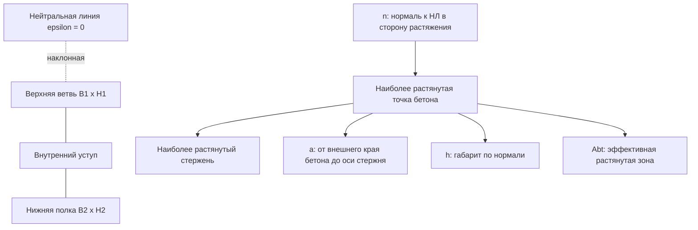

# Методический отчет по расчету ширины раскрытия нормальных трещин по СП 63 для НДМ `N + Mx + My`

Дата актуализации: 2026-09-21.

Основной источник: локальный документ `norms/SP_63/СП 63.13330.2018 ... _Текст.pdf` и одноименный RTF. Формулы 8.128-8.138 проверены по отрисованным страницам PDF, так как текстовый слой PDF не всегда извлекает математические обозначения.

Документ фиксирует методику, по которой сверяется текущая реализация расчета ширины раскрытия нормальных трещин. Актуальная Excel-справка в книге описывает пользовательскую последовательность более подробно; при расхождении приоритет имеют текущий код и справка в собранной книге.

## 1. Границы задачи

Рассматривается расчет ширины раскрытия нормальных трещин для общего напряженно-деформированного состояния:

```text
N + Mx + My
```

Не рассматриваются:

- расчет наклонных трещин;
- предварительно напряженная арматура;
- окончательная нормативная трассировка по СП 35 для мостовых конструкций.

Для расчета трещин должны использоваться сочетания второй группы. Это отдельные, как правило меньшие, нагрузки по сравнению с расчетом прочности. Нельзя автоматически брать состояние от предельного расчета первой группы.

## 2. Нормативная база СП 63

### 2.1. Общая НДМ-постановка

СП 63 разрешает расчет нормальных сечений произвольной формы на основе нелинейной деформационной модели.

Ключевые положения:

- п. 8.1.22 задает знаки: сжатие бетона и арматуры принимается со знаком минус, растяжение со знаком плюс;
- п. 8.1.22 разрешает выбирать начало координат в произвольном месте в пределах сечения;
- п. 8.1.23 задает равновесие внешних и внутренних усилий формулами (8.26)-(8.28);
- п. 8.1.23 задает плоское распределение деформаций формулами (8.29)-(8.30);
- п. 8.1.23 задает связи напряжений и деформаций материалов формулами (8.31)-(8.32);
- п. 8.1.23 задает преобразование внешних моментов с учетом точки приложения продольной силы формулами (8.33)-(8.34);
- п. 8.1.25 задает решение общей системы при `N + Mx + My` формулами (8.39)-(8.47).

В текущей программе эта часть соответствует `CSectionSolver`: решатель ищет три неизвестных параметра плоскости деформаций:

```text
epsilon(x, y) = epsilon0 + kappaX * y + kappaY * x
```

Из найденного НДС уже можно получить:

- `epsilon0`;
- `kappaX`;
- `kappaY`;
- внутренние `Nint`, `Mxint`, `Myint`;
- деформацию любого бетонного волокна;
- напряжение любого бетонного волокна через диаграмму бетона;
- деформацию любого стержня;
- напряжение любого стержня через диаграмму арматуры;
- положение нейтральной линии `epsilon(x, y) = 0`.

### 2.2. Условие проверки ширины раскрытия

СП 63 п. 8.2.6:

```text
a_crc <= a_crc,ult                                      (8.118)
```

где:

- `a_crc` - ширина раскрытия трещин от действия внешней нагрузки;
- `a_crc,ult` - предельно допустимая ширина раскрытия трещин.

СП 63 п. 8.2.7:

```text
a_crc = a_crc1                                         (8.119)
```

для продолжительного раскрытия трещин.

Для непродолжительного раскрытия:

```text
a_crc = a_crc1 + a_crc2 - a_crc3                       (8.120)
```

где:

- `a_crc1` - раскрытие от продолжительного действия постоянных и временных длительных нагрузок;
- `a_crc2` - раскрытие от непродолжительного действия постоянных, временных длительных и кратковременных нагрузок;
- `a_crc3` - раскрытие от непродолжительного действия постоянных и временных длительных нагрузок.

Инженерный вывод для текущей реализации: программа считает только продолжительное раскрытие нормальных трещин по II группе, а коэффициент `phi1` берет из настройки `SLS.Crack.Phi1`. Для продолжительного раскрытия обычно принимают `phi1 = 1.4`. Отдельный параметр продолжительности в каждой строке `rngLoadCombinations` не используется. Непродолжительное раскрытие по формуле (8.120) в текущей версии не реализовано и требует отдельного проектного решения.

### 2.3. Основная формула ширины раскрытия

СП 63 п. 8.2.15:

```text
a_crc,i = phi1 * phi2 * phi3 * psi_s * (sigma_s / Es) * ls       (8.128)
```

где:

- `sigma_s` - напряжение в продольной растянутой арматуре в нормальном сечении с трещиной от соответствующей внешней нагрузки;
- `Es` - модуль упругости арматуры;
- `ls` - базовое расстояние между смежными нормальными трещинами без учета вида поверхности арматуры;
- `psi_s` - коэффициент неравномерного распределения относительных деформаций растянутой арматуры между трещинами;
- `phi1` - коэффициент продолжительности действия нагрузки;
- `phi2` - коэффициент профиля продольной арматуры;
- `phi3` - коэффициент характера нагружения.

По п. 8.2.15:

```text
phi1 = 1.0  для непродолжительного действия нагрузки
phi1 = 1.4  для продолжительного действия нагрузки

phi2 = 0.5  для арматуры периодического профиля и канатной
phi2 = 0.8  для гладкой арматуры

phi3 = 1.0  для изгибаемых и внецентренно сжатых элементов
phi3 = 1.2  для растянутых элементов
```

Для текущей программы с обычной ненапрягаемой арматурой обычно ожидается `phi2 = 0.5`. Для `N + Mx + My` значение `phi3` выбирается по общему объекту нагрузки: при растягивающей продольной силе используется значение для растянутых элементов, иначе - значение для изгиба и внецентренного сжатия. Проверка центрального растяжения выполняется отдельно по моментам относительно центра тяжести приведенного сечения.

## 3. Напряжение в арматуре `sigma_s`

### 3.1. Формулы СП для типовых сечений

СП 63 п. 8.2.16 дает формулы для определения `sigma_s`.

Для изгибаемых элементов:

```text
sigma_s = M * (h0 - yc) / Ired * alpha_s1              (8.129)
```

Коэффициент приведения:

```text
alpha_s1 = Es / Eb,red                                 (8.130)
```

Приведенный модуль бетона:

```text
Eb,red = Rb,n / epsilon_b1,red                         (8.131)
```

При этом `epsilon_b1,red = 0.0015`.

Допускаемая упрощенная формула:

```text
sigma_s = M / (zs * As)                                (8.132)
```

Для прямоугольного сечения без учета сжатой арматуры:

```text
zs = h0 - x / 3                                        (8.133)
```

При совместном действии изгибающего момента и продольной силы:

```text
sigma_s = [ M * (h0 - yc) / Ired +/- N / Ared ] * alpha_s1   (8.134)
```

Допускаемая упрощенная формула:

```text
sigma_s = N * (es + zs) / (As * zs)                    (8.135)
```

В формулах (8.134) и (8.135) знак плюс принимается при растягивающей продольной силе, знак минус - при сжимающей. Напряжение `sigma_s` не должно превышать `Rs,ser`.

### 3.2. Интерпретация для текущей НДМ `N + Mx + My`

Для произвольного сечения и косого изгиба СП 63 не дает отдельной прямой формулы вида (8.129)-(8.135). В текущей программе более естественно брать `sigma_s` непосредственно из НДМ:

```text
epsilon_si = epsilon0 + kappaX * y_i + kappaY * x_i
sigma_si = sigma_s_diagram(epsilon_si)
sigma_si <= Rs,ser
```

Статус: инженерная интерпретация на основе п. 8.1.23, 8.1.25 и п. 8.2.32. Это не отдельная явная формула СП 63 для произвольного сечения, но она согласуется с НДМ: напряжение в арматуре определяется через деформацию стержня и диаграмму арматуры.

Текущий алгоритм программы:

1. Для каждого стержня вычислить `epsilon_si`.
2. Если `epsilon_si <= 0`, стержень не является растянутым для расчета нормальной трещины.
3. Для растянутого стержня вычислить `sigma_si` по пользовательской диаграмме арматуры.
4. Ограничить `sigma_si` сверху значением `Rs,ser`, если оно задано в настройках.
5. Для группы стержней эффективной зоны использовать:

```text
sigma_s,eff = sum(As_i * sigma_si) / sum(As_i)
```

6. Дополнительно выводить максимальное значение `sigma_s,max` для диагностики и ручной проверки.

Альтернатива: считать `a_crc` отдельно для каждого стержня или группы стержней с локальной площадью взаимодействия и брать максимум. Это более консервативно и лучше подходит для сильно неравномерной арматуры, но требует более сложного разбиения растянутой зоны.

## 4. Базовое расстояние между трещинами `ls`

СП 63 п. 8.2.17:

```text
ls = 0.5 * (Abt / As) * ds                              (8.136)
```

Ограничения по п. 8.2.17:

```text
ls >= 10 * ds
ls >= 100 мм
ls <= 40 * ds
ls <= 400 мм
```

Практическое применение ограничений:

```text
ls0 = 0.5 * (Abt / As) * ds
ls_min = max(10 * ds, 100 мм)
ls_max = min(40 * ds, 400 мм)
ls = min(max(ls0, ls_min), ls_max)
```

Если `ls_min > ls_max`, ограничения конфликтуют. Например, для очень большого диаметра `10ds > 400 мм`. СП 63 отдельно не раскрывает этот конфликт. Инженерная рекомендация: не скрывать ситуацию, а выдать диагностическое предупреждение и использовать более жесткую верхнюю границу `ls = ls_max` только после явного подтверждения методики пользователем.

Параметры:

- `Abt` - площадь растянутого бетона;
- `As` - площадь растянутой арматуры;
- `ds` - номинальный диаметр арматуры.

## 5. Геометрия произвольного сечения

### 5.1. Нейтральная линия

После решения НДС:

```text
epsilon(x, y) = epsilon0 + kappaX * y + kappaY * x
```

Нейтральная линия:

```text
epsilon0 + kappaX * y + kappaY * x = 0
```

Вектор нормали к нейтральной линии в сторону растяжения:

```text
n = (kappaY, kappaX) / sqrt(kappaY^2 + kappaX^2)
```

Если `kappaX = 0` и `kappaY = 0`, поле деформаций равномерное. Тогда:

- при `epsilon0 <= 0` нормальная трещина не рассчитывается, так как растяжения нет;
- при `epsilon0 > 0` задача близка к центральному растяжению; направление нормали не определяется из кривизн и должно задаваться инженерно либо расчет ведется по всей площади растянутого бетона.

### 5.2. Габарит `h` по нормали

Для произвольного бетонного сечения:

```text
s = dot((x, y), n)
h = max(s по бетонному контуру) - min(s по бетонному контуру)
```

Важно: `h` нужно брать по внешнему контуру бетона, а не по центрам волокон. Иначе при крупной сетке будет систематическая ошибка примерно на половину размера ячейки.

### 5.3. Наиболее растянутая точка бетона

Наиболее растянутая точка бетона - точка внешнего бетонного контура с максимальным значением:

```text
s_t = max(dot((x, y), n))
```

Для полигонального сечения это вершина или участок внешнего контура. Для дискретной сетки это нужно определять по геометрии ячеек или исходному контуру, а не только по центрам волокон.

### 5.4. Расстояние `a`

По требованию пользователя и физическому смыслу п. 8.2.17:

```text
a = s_t - s_bar,max
```

где `s_bar,max` - проекция оси наиболее растянутого стержня на нормаль `n`.

Иными словами, `a` - расстояние от внешнего края наиболее растянутого бетонного волокна до оси наиболее растянутого стержня, измеренное по нормали к нейтральной линии. Это не расстояние от центра крайнего бетонного волокна.

### 5.5. Глубина растянутой зоны

Положение нейтральной линии в координате `s`:

```text
s0 = -epsilon0 / sqrt(kappaY^2 + kappaX^2)
```

Глубина фактически растянутой зоны:

```text
x_t = s_t - s0
```

Если `x_t <= 0`, бетон по выбранной нормали не имеет растянутой зоны.

### 5.6. Эффективная зона для `Abt`

СП 63 п. 8.2.17: значения `Abt` определяют по высоте растянутой зоны бетона `x_t`; в любом случае `Abt` принимают равным площади сечения при ее высоте в пределах не менее `2a` и не более `0.5h`.

Инженерная интерпретация для произвольного сечения:

```text
h_bt = min(max(x_t, 2a), 0.5h)
```

Зона `Abt`:

```text
s >= s_t - h_bt
```

Если `h_bt` по нижнему ограничению `2a` заходит за нейтральную линию, расчетную полосу не следует обрезать по нейтральной линии: для `Effective` бетонные элементы включаются в `Abt` по попаданию центра в полосу `s >= s_t - h_bt`. Это принятое численное продолжение п. 8.2.17 для дискретной НДМ-модели, чтобы условие `h_bt >= 2a` выполнялось буквально.

Для волоконной модели:

- точный вариант: клиппинг бетонных ячеек или исходного полигона границей эффективной зоны;
- приближенный вариант: суммирование полных площадей волокон, центры которых попали в зону;
- предпочтительный вариант для программы: использовать фактические расчетные бетонные элементы с учетом дробления границ и по возможности частично учитывать пересекаемые границей элементы.

### 5.7. Выбор `As`

СП 63 п. 8.2.17 говорит об `As` как площади растянутой арматуры. Для произвольного сечения при косом изгибе прямой инструкции нет.

Рекомендуемая инженерная интерпретация:

```text
As = sum(As_i)
```

по всем стержням, которые одновременно:

1. имеют `epsilon_si > 0`;
2. находятся в эффективной растянутой зоне `s_i >= s_t - h_bt`;
3. являются продольной ненапрягаемой арматурой.

Альтернативы:

- включать всю растянутую арматуру независимо от попадания в эффективную зону;
- считать локальные зоны взаимодействия вокруг каждого стержня и брать максимальный `a_crc`;
- группировать стержни по близким значениям `s_i` и диаметру.

Для текущей программы наиболее прозрачный первый вариант: он напрямую связан с вычисленным `Abt` и легко проверяется на листе.

### 5.8. Обобщение `ds` при разных диаметрах

СП 63 п. 8.2.17 дает один `ds`, но не раскрывает случай разных диаметров в одной эффективной зоне.

Рекомендуемая инженерная интерпретация:

```text
ds,eq = sum(As_i * d_i) / sum(As_i)
```

Почему так:

- формула (8.136) использует произведение `(Abt / As) * ds`;
- площадь арматуры уже входит через `As`;
- площадь-взвешенный диаметр сохраняет вклад крупных стержней без резкого перехода к самому большому диаметру.

Консервативная альтернатива:

```text
ds = max(d_i)
```

Она обычно увеличивает `ls` и `a_crc`, но может давать завышение при единичном крупном стержне в группе.

Рекомендуется выводить оба значения:

- `ds,eq` - расчетное;
- `ds,max` - контрольное консервативное.

## 6. Коэффициент `psi_s`

СП 63 п. 8.2.15 допускает принимать:

```text
psi_s = 1
```

Если при этом условие (8.118) не выполняется, значение `psi_s` следует определять по формуле (8.138).

СП 63 п. 8.2.18:

```text
psi_s = 1 - 0.8 * sigma_s,crc / sigma_s                 (8.137)
```

где:

- `sigma_s,crc` - напряжение в продольной растянутой арматуре в сечении с трещиной сразу после образования нормальных трещин;
- `sigma_s` - то же при действии рассматриваемой нагрузки.

Для изгибаемых элементов допускается:

```text
psi_s = 1 - 0.8 * Mcrc / M                              (8.138)
```

где `Mcrc` определяют по формуле (8.121).

Инженерный вывод для программы:

- факт образования нормальной трещины проверяется до расчета ширины независимо от `SLS.Crack.PsiMode`;
- в режиме `User` программа принимает `psi_s` из `SLS.Crack.PsiS` после положительной проверки образования трещины;
- в режиме `Auto` программа сначала считает ширину при `psi_s = 1`, а при непрохождении проверки уточняет коэффициент по уже найденному состоянию сразу после образования трещины. Если точка трещинообразования найдена, сохраняется `BeforeMcrcState` с работающим растянутым бетоном и `AfterMcrcState` сразу после образования трещины без работы растянутого бетона;
- `lambda_crc` ищется по достижению предельной растягивающей деформации бетона `eps_bt,ult` по СП 63 п. 8.2.14 и п. 8.1.30: при двузначной эпюре `eps_bt,ult = eps_bt2`, при однозначно растянутой эпюре с ненулевой кривизной применяется формула (8.54) `eps_bt,ult = eps_bt2 - (eps_bt2 - eps_bt0) * eps1 / eps2`;
- истинное центральное растяжение остается отдельной нормативной веткой через расчетную силу `Ncrc`, а не решается подбором нейтральной линии и плоскости `eps_bt,ult`; при необходимости уточнения `psi_s` для него решается `AfterMcrcState` без растянутого бетона на уровне нагрузки, соответствующем появлению трещины;
- `sigma_s,crc` для формулы (8.137) берется из `AfterMcrcState`, то есть из НДС с трещиной сразу после образования нормальных трещин;
- при `psi_s < 0` физически следует ограничивать снизу нулем или выдавать ошибку входных данных, так как отрицательная ширина трещин невозможна. СП 63 прямо не описывает это ограничение; это численная защита.

## 7. Пошаговый алгоритм для текущей программы

### Шаг 1. Выбрать расчетное сочетание второй группы

Данные:

- `N`, `Mx`, `My`;
- тип действия нагрузки: непродолжительное или продолжительное;
- допустимая ширина `a_crc,ult`.

Нормативная ссылка: п. 8.2.5-8.2.7, формулы (8.118)-(8.120).

### Шаг 2. Решить НДС с трещиной

Выполнить прямой расчет `CSectionSolver` для `N + Mx + My`.

Для уже образовавшейся трещины:

- растянутый бетон в сечении с трещиной не должен работать;
- сжатый бетон работает по диаграмме;
- вся продольная арматура участвует в равновесии.

Нормативная логика: п. 8.2.27 для сечений с трещинами и п. 8.2.32 для определения кривизн на основе НДМ; общая система НДМ - п. 8.1.23 и 8.1.25.

Выход:

```text
epsilon0, kappaX, kappaY
Nint, Mxint, Myint
epsilon_bi, sigma_bi
epsilon_si, sigma_si
```

### Шаг 3. Построить нейтральную линию и нормаль

```text
epsilon0 + kappaX * y + kappaY * x = 0
n = (kappaY, kappaX) / sqrt(kappaY^2 + kappaX^2)
```

Нормативная ссылка: п. 8.1.23, формулы (8.29)-(8.30).

### Шаг 4. Найти `h`, наиболее растянутую точку и `a`

```text
s = dot((x, y), n)
h = max(s по контуру) - min(s по контуру)
s_t = max(s по контуру)
a = s_t - s_bar,max
```

Нормативная ссылка: п. 8.2.17 для ограничений `2a` и `0.5h`.

Статус: определение направления и проекций для произвольного косого изгиба - инженерная интерпретация.

### Шаг 5. Определить `Abt`

```text
s0 = -epsilon0 / sqrt(kappaY^2 + kappaX^2)
x_t = s_t - s0
h_bt = min(max(x_t, 2a), 0.5h)
Abt = area(concrete intersection with strip s >= s_t - h_bt)
```

Нормативная ссылка: п. 8.2.17, формула (8.136), текст после формулы.

Статус: вычисление площади через клиппинг произвольной геометрии или суммирование волокон - инженерная численная реализация.

### Шаг 6. Выбрать растянутую арматуру

Для каждого стержня:

```text
epsilon_si = epsilon0 + kappaX * y_i + kappaY * x_i
s_i = dot((x_i, y_i), n)
```

Стержень включается в расчет `As`, если:

```text
epsilon_si > 0
s_i >= s_t - h_bt
```

Нормативная ссылка: п. 8.2.17, `As` как площадь сечения растянутой арматуры.

Статус: ограничение стержней эффективной зоной для произвольного сечения - инженерная интерпретация.

### Шаг 7. Определить `As`, `ds`, `sigma_s`

```text
As = sum(As_i)
ds,eq = sum(As_i * d_i) / As
sigma_s = sum(As_i * sigma_si) / As
```

Проверка:

```text
sigma_s <= Rs,ser
```

Нормативная ссылка: п. 8.2.16 для `sigma_s`, п. 8.2.17 для `As` и `ds`.

Статус: `ds,eq` и `sigma_s` по группе стержней разных диаметров - инженерная интерпретация.

### Шаг 8. Определить `ls`

```text
ls0 = 0.5 * (Abt / As) * ds,eq
ls = min(max(ls0, max(10ds, 100 мм)), min(40ds, 400 мм))
```

Нормативная ссылка: п. 8.2.17, формула (8.136).

### Шаг 9. Определить `psi_s`

Вариант по умолчанию:

```text
psi_s = 1
```

Уточненный вариант:

```text
psi_s = 1 - 0.8 * sigma_s,crc / sigma_s
```

или для изгибаемых элементов:

```text
psi_s = 1 - 0.8 * Mcrc / M
```

Нормативная ссылка: п. 8.2.15, п. 8.2.18, формулы (8.137)-(8.138).

### Шаг 10. Рассчитать `a_crc`

```text
a_crc = phi1 * phi2 * phi3 * psi_s * (sigma_s / Es) * ls
```

Нормативная ссылка: п. 8.2.15, формула (8.128).

### Шаг 11. Проверить предельное значение

```text
utilization = a_crc / a_crc,ult
a_crc <= a_crc,ult
```

Нормативная ссылка: п. 8.2.6, формула (8.118).

## 8. Схемы

### 8.1. Г-сечение, нейтральная линия и нормаль



### 8.2. Проекции на нормаль

```text
      растяжение
          ^
          | n
          |
 s_t  ----*---------------- внешний край наиболее растянутого бетона
          |\
          | \ a
 s_b  ----o---------------- ось наиболее растянутого стержня
          |
          |<--- h_bt --->   эффективная зона Abt
          |
 s0   ----/---------------- нейтральная линия epsilon = 0
          |
      сжатие
```

### 8.3. Стержни разных диаметров

```text
Выбранная эффективная зона Abt:

    d20     d25     d16
     o       O       o
     |       |       |
   As1     As2     As3

As     = As1 + As2 + As3
ds,eq  = (As1*d20 + As2*d25 + As3*d16) / As
sigma  = (As1*sigma1 + As2*sigma2 + As3*sigma3) / As
```

## 9. Числовой пример Г-образного сечения

Пример является методическим и нужен для проверки последовательности вычислений. Он не является результатом запуска программы.

### 9.1. Геометрия

Г-сечение задано двумя прямоугольниками:

- нижняя полка: `B2 = 600 мм`, `H2 = 250 мм`;
- верхняя ветвь: `B1 = 250 мм`, `H1 = 800 мм`;
- полная высота: `H = 1050 мм`;
- внешний контур в локальных координатах:

```text
(0,0) -> (600,0) -> (600,250) -> (250,250) -> (250,1050) -> (0,1050)
```

### 9.2. Заданная плоскость деформаций

```text
epsilon0 = -0.000400
kappaX   =  2.200e-6 1/мм
kappaY   = -1.100e-6 1/мм
```

Поле:

```text
epsilon(x,y) = -0.000400 + 2.200e-6*y - 1.100e-6*x
```

Нормаль к нейтральной линии в сторону растяжения:

```text
n = (-0.4472; 0.8944)
```

Проекции бетонного контура:

```text
s_min = -268.33 мм
s_max =  939.15 мм
h     = 1207.48 мм
```

Координата нейтральной линии:

```text
s0 = 162.62 мм
x_t = s_max - s0 = 776.53 мм
```

### 9.3. Арматура

| ID | X, мм | Y, мм | d, мм | As, мм2 | epsilon_s | sigma_s, МПа |
|---|---:|---:|---:|---:|---:|---:|
| T1 | 70 | 1000 | 20 | 314.16 | 0.001723 | 344.6 |
| L5 | 50 | 980 | 25 | 490.87 | 0.001701 | 340.2 |
| T2 | 125 | 1000 | 20 | 314.16 | 0.001663 | 332.5 |
| T3 | 180 | 1000 | 20 | 314.16 | 0.001602 | 320.4 |
| IR4 | 210 | 920 | 16 | 201.06 | 0.001393 | 278.6 |
| L4 | 50 | 765 | 25 | 490.87 | 0.001228 | 245.6 |
| IR3 | 210 | 720 | 16 | 201.06 | 0.000953 | 190.6 |
| L3 | 50 | 550 | 25 | 490.87 | 0.000755 | 151.0 |
| IR2 | 210 | 525 | 16 | 201.06 | 0.000524 | 104.8 |
| L2 | 50 | 335 | 25 | 490.87 | 0.000282 | 56.4 |
| IR1 | 210 | 330 | 16 | 201.06 | 0.000095 | 19.0 |
| остальные нижние/правые стержни | - | - | 20-32 | - | < 0 | сжатие |

Здесь `sigma_s = Es * epsilon_s` при `Es = 200000 МПа`; ограничение `Rs,ser` в примере не сработало.

### 9.4. Определение `a`

Наиболее растянутая точка бетона:

```text
(0; 1050), epsilon = 0.001910
```

Наиболее растянутый стержень:

```text
T1: (70; 1000), d = 20 мм, epsilon_s = 0.001723
```

Расстояние от внешнего края бетона до оси стержня по нормали:

```text
a = 76.03 мм
2a = 152.05 мм
0.5h = 603.74 мм
```

Так как:

```text
x_t = 776.53 мм > 0.5h = 603.74 мм
```

принимаем:

```text
h_bt = 603.74 мм
```

### 9.5. Определение `Abt`

Эффективная зона:

```text
s >= s_max - h_bt
s >= 939.15 - 603.74 = 335.41 мм
```

Пересечение этой полосы с Г-образным бетонным контуром дает полигон:

```text
(250;500) -> (250;1050) -> (0;1050) -> (0;375)
```

Площадь:

```text
Abt = 153125 мм2
```

### 9.6. Стержни, включенные в `As`

Критерий:

```text
epsilon_s > 0
s_i >= 335.41 мм
```

Включены:

| ID | d, мм | As, мм2 | sigma_s, МПа |
|---|---:|---:|---:|
| L3 | 25 | 490.87 | 151.0 |
| L4 | 25 | 490.87 | 245.6 |
| L5 | 25 | 490.87 | 340.2 |
| T1 | 20 | 314.16 | 344.6 |
| T2 | 20 | 314.16 | 332.5 |
| T3 | 20 | 314.16 | 320.4 |
| IR2 | 16 | 201.06 | 104.8 |
| IR3 | 16 | 201.06 | 190.6 |
| IR4 | 16 | 201.06 | 278.6 |

Суммарная площадь:

```text
As = 3018.29 мм2
```

Эквивалентный диаметр:

```text
ds,eq = sum(As_i * d_i) / As = 21.64 мм
```

Средневзвешенное напряжение:

```text
sigma_s,eff = sum(As_i * sigma_i) / As = 261.89 МПа
```

Для диагностики:

```text
sigma_s,max = 344.6 МПа
```

### 9.7. Расстояние между трещинами

По формуле (8.136):

```text
ls0 = 0.5 * (Abt / As) * ds,eq
    = 0.5 * (153125 / 3018.29) * 21.64
    = 548.93 мм
```

Ограничения:

```text
10ds = 216.40 мм
100 мм
40ds = 865.60 мм
400 мм
```

Итого:

```text
ls_min = 216.40 мм
ls_max = 400 мм
ls = 400 мм
```

Сработало верхнее ограничение `400 мм`.

### 9.8. Коэффициент `psi_s`

Вариант 1, разрешенный п. 8.2.15:

```text
psi_s = 1.0
```

Вариант 2, если отдельно известен `sigma_s,crc`. Для демонстрации принимаем:

```text
sigma_s,crc = 70 МПа
```

Тогда по (8.137):

```text
psi_s = 1 - 0.8 * 70 / 261.89 = 0.786
```

Важно: значение `sigma_s,crc = 70 МПа` в этом примере условное и показано только для демонстрации формулы (8.137). В режиме `Auto` программа получает `sigma_s,crc` из отдельного состояния `AfterMcrcState` при нагрузке `lambda_crc * LC` после выключения растянутого бетона.

### 9.9. Итоговая ширина раскрытия

Для арматуры периодического профиля:

```text
phi2 = 0.5
```

Для внецентренно сжатого/изгибаемого элемента:

```text
phi3 = 1.0
```

Для непродолжительного действия:

```text
phi1 = 1.0
```

С `psi_s = 1.0`:

```text
a_crc = 1.0 * 0.5 * 1.0 * 1.0 * (261.89 / 200000) * 400
      = 0.262 мм
```

С `psi_s = 0.786`:

```text
a_crc = 1.0 * 0.5 * 1.0 * 0.786 * (261.89 / 200000) * 400
      = 0.206 мм
```

Если принять `a_crc,ult = 0.3 мм`, коэффициент использования:

```text
utilization = 0.262 / 0.3 = 0.87     при psi_s = 1.0
utilization = 0.206 / 0.3 = 0.69     при psi_s = 0.786
```

## 10. Что должно выводиться из НДМ на лист

Минимальный набор для прозрачного формульного расчета трещин:

| Данные | Источник | Назначение |
|---|---|---|
| `epsilon0`, `kappaX`, `kappaY` | `CSectionSolver` | построение нейтральной линии, деформации стержней и волокон |
| координаты и площадь бетонных волокон/элементов | mesh | расчет `Abt` |
| размеры бетонных элементов или исходный контур | geometry/mesh | учет внешнего края, `h`, `a`, частичное попадание в зону |
| координаты стержней | `CRebarLayout` | выбор растянутой арматуры |
| диаметры стержней | `CRebarLayout` | `ds`, `ds,eq`, ограничения `10ds...40ds` |
| площади стержней | `CRebarLayout` | `As` |
| деформации стержней | НДМ | выбор растянутых стержней |
| напряжения стержней | диаграмма арматуры | `sigma_s` |
| `Es`, `Rs,ser` | `Config` | формула (8.128), ограничение п. 8.2.16 |
| `phi1`, `phi2`, `phi3`, `psi_s` или данные для него | `Config`/формулы | коэффициенты СП |
| `a_crc,ult` | `Config` | проверка (8.118) |

Рекомендуется выводить на лист не только итог `a_crc`, но и промежуточные `h`, `a`, `x_t`, `h_bt`, `Abt`, `As`, `ds,eq`, `sigma_s,eff`, `sigma_s,max`, `ls0`, `ls`, сработавшие ограничения.

## 11. Места, требующие инженерного обобщения

| Вопрос | Что прямо есть в СП 63 | Обобщение для программы |
|---|---|---|
| Произвольное сечение при косом изгибе | Общая НДМ для `N + Mx + My` в 8.1.23, 8.1.25 | Использовать нормаль к нейтральной линии для всех размеров трещин |
| `h` для произвольного сечения | В 8.2.17 используется `h`, но без алгоритма для произвольной формы | Брать габарит бетонного контура по нормали к нейтральной линии |
| `a` | В 8.2.17 используется ограничение `2a` | Измерять от внешнего растянутого края бетона до оси наиболее растянутого стержня по нормали |
| `Abt` | Площадь бетона эффективной зоны, высота не менее `2a` и не более `0.5h` | В режиме `Effective` считать площадь бетонных волокон по попаданию центра в полосу `h_bt`, даже если она частично зашла за нейтральную линию |
| Разные диаметры | Формула (8.136) содержит один `ds` | Использовать `ds,eq = sum(n_i*d_i^2)/sum(n_i*d_i)` |
| Неравномерные напряжения в арматуре | Формулы 8.129-8.135 ориентированы на типовые схемы | Брать напряжения каждого стержня из НДМ; для группы использовать средневзвешенное или локальные группы |
| `psi_s` без `Mcrc` | Допускается пользовательское `psi_s`, уточнение через 8.137/8.138 | `User`: брать `SLS.Crack.PsiS`; `Auto`: при непрохождении первой проверки вычислять `sigma_s,crc` из `AfterMcrcState` |
| Центральное растяжение | Есть условие 8.117 и формула 8.127 | При нулевых кривизнах нормаль не определена; нужна отдельная ветка или пользовательское направление |
| Частичное попадание волокон | СП оперирует площадями сечения | Для точности использовать клиппинг ячеек, иначе возможна сеточная погрешность |

## 12. Сводная таблица шагов

| Шаг | Формула/решение | Пункт СП 63 | Требование СП / допущение | Комментарий |
|---:|---|---|---|---|
| 1 | `a_crc <= a_crc,ult` | 8.2.6, (8.118) | Требование СП | Основная проверка |
| 2 | `a_crc = a_crc1` или `a_crc1+a_crc2-a_crc3` | 8.2.7, (8.119)-(8.120) | Требование СП | Нужно различать длительное/кратковременное раскрытие |
| 3 | Решить `N + Mx + My` по НДМ | 8.1.23, 8.1.25, 8.2.32 | Требование СП | Для трещины растянутый бетон не учитывается |
| 4 | `epsilon = epsilon0 + kappaX*y + kappaY*x` | 8.1.23, (8.29)-(8.30) | Требование СП | В программе это текущая плоскость деформаций |
| 5 | Нейтральная линия `epsilon=0` | 8.1.23 | Требование СП | Нужна для растянутой зоны |
| 6 | Нормаль `n=(kappaY,kappaX)/norm` | 8.1.23 | Допущение | Численное обобщение для косого изгиба |
| 7 | `h=max(s)-min(s)` по контуру | 8.2.17 | Допущение | Габарит по нормали |
| 8 | `a=s_t-s_bar` | 8.2.17 | Допущение | От внешнего края бетона до оси стержня |
| 9 | `h_bt=min(max(x_t,2a),0.5h)` | 8.2.17 | Требование СП + численная интерпретация | Нужна диагностика конфликтов |
| 10 | `Abt=area(...)` | 8.2.17, (8.136) | Допущение | Клиппинг полигона или волокон |
| 11 | `As=sum(As_i)` | 8.2.17, (8.136) | Требование СП + интерпретация | Только растянутая арматура эффективной зоны |
| 12 | `ds,eq=sum(n_i*d_i^2)/sum(n_i*d_i)` | 8.2.17, (8.136) | Допущение | СП не раскрывает разные диаметры |
| 13 | `sigma_s` из НДМ по стержням | 8.1.23, 8.2.16 | Допущение | Альтернатива формулам 8.129-8.135 для произвольного сечения |
| 14 | `ls=0.5*(Abt/As)*ds` | 8.2.17, (8.136) | Требование СП | Затем применяются ограничения |
| 15 | `10ds`, `100 мм`, `40ds`, `400 мм` | 8.2.17 | Требование СП | Нижняя граница - максимум, верхняя - минимум |
| 16 | `psi_s=1` | 8.2.15 | Требование СП / допуск СП | Разрешено принимать |
| 17 | `psi_s=1-0.8*sigma_s,crc/sigma_s` | 8.2.18, (8.137) | Требование СП при уточнении | Нужен расчет/ввод `sigma_s,crc` |
| 18 | `psi_s=1-0.8*Mcrc/M` | 8.2.18, (8.138) | Допускаемый СП вариант | Для изгибаемых элементов |
| 19 | `a_crc=phi1*phi2*phi3*psi_s*sigma_s/Es*ls` | 8.2.15, (8.128) | Требование СП | Итоговая ширина |

## 13. Рекомендации перед реализацией

1. Оставить расчет НДС в `CSectionSolver`; не дублировать равновесие в расчете трещин.
2. На лист выводить всю таблицу стержней: `ID`, `x`, `y`, `d`, `As`, `epsilon_s`, `sigma_s`, `s`, расстояние от растянутого края, флаг включения в `As`.
3. На лист выводить геометрию эффективной зоны: `n`, `h`, `a`, `x_t`, `h_bt`, `Abt`.
4. Расчет `Abt`, `As`, `ds`, `ls`, `psi_s`, `a_crc` выполнять прозрачными формулами на листе или выводить формульный блок, чтобы пользователь мог сверить методику.
5. Для `SLS.Crack.PsiMode = Auto` использовать уже найденное `AfterMcrcState` для `sigma_s,crc`; повторно искать точку образования трещины на шаге уточнения `psi_s` не нужно.
6. Для разных диаметров принять `ds,eq = sum(n_i*d_i^2)/sum(n_i*d_i)` как основной расчетный вариант и выводить его в подробной таблице трещин.
7. Для произвольных сечений обязательно фиксировать в отчете расчетного сочетания, что `h`, `a`, `Abt` получены по нормали к нейтральной линии. Это инженерная интерпретация, которую можно локально заменить после экспертного решения.
