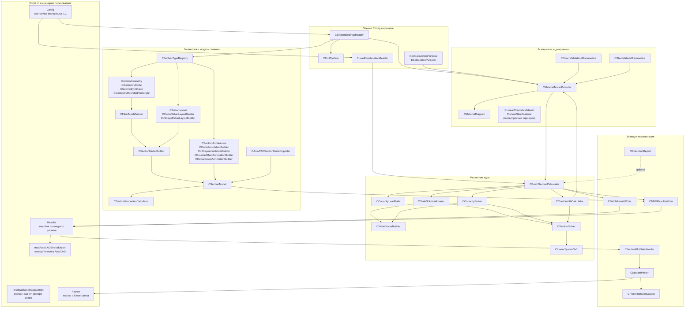

# Полная Архитектура RC Section NDM

Дата актуализации: 2026-08-29.

Документ описывает фактическую архитектуру проекта после перехода на единый
pipeline `Config -> Batch -> Results snapshot -> Plot/AutoCAD`. Цель документа -
дать одну карту проекта: какие классы существуют, за что отвечают, какими
методами пользуются соседние слои и где проходят границы ответственности.

## Общая UML-Схема



## Главные Потоки Данных

### Расчет Generated-Сечения

```text
Config
  -> CSystemSettingsReader
  -> CUnitSystem
  -> CSectionTypeRegistry
       -> CGeometry*
       -> CFiberMeshBuilder
       -> C*RebarLayoutBuilder
       -> C*AnnotationBuilder
  -> CSectionModel
  -> CMaterialModelProvider
  -> CLoadCombinationReader
  -> CBatchSectionCalculator
       -> CStateSolutionRunner -> CSectionSolver
       -> CCapacityLoadPath -> CCapacitySolver -> CSectionSolver
       -> CCrackWidthCalculator -> CSectionSolver
  -> CBatchResultWriter + CNDMResultsWriter
  -> Results
  -> CSectionPlotDataReader -> CSectionPlotter
```

### Расчет AutoCAD-Геометрии

```text
AutoCAD Region
  -> CAutoCADSectionModelImporter
  -> CSectionModel
  -> CNDMResultsWriter.WriteGeometryPreview
  -> Results preview
  -> CSectionPlotter preview

После нажатия "Выполнить расчет":
Results preview / imported CSectionModel
  -> тот же Batch pipeline
  -> Results snapshot
```

Расчет не импортирует AutoCAD заново. Импорт выполняется отдельной кнопкой, а
batch использует уже сохраненную импортированную модель.

### Обновление Excel-Схемы

```text
Results snapshot
  -> CSectionPlotDataReader
  -> CSectionPlotter
       -> CPlotAnnotationLayout
  -> ChartObject на листе Расчет
```

Схема не запускает решатель и не читает текущую геометрию из `Config`. Она
показывает только последний сохраненный snapshot.

### AutoCAD Export

```text
Results snapshot
  -> modAutoCADStressExport.ReadSectionGeometryFromResults
  -> ReadElementResultsForCombination
  -> DrawResultsStressExport
  -> активный чертеж AutoCAD
```

Экспорт не пересчитывает НДС по текущему `Config`, а читает напряжения,
деформации, `PhysicalState`, `ExtensionUsed`, свойства и геометрию из `Results`.

## Слои И Ответственность

### Excel UI / Сценарии

`modWorkbookCalculation` - верхний слой пользовательских кнопок. Он читает
настройки, создает модель, запускает batch, вызывает writer-ы и обновляет схему.
В нем не должно быть численной логики равновесия.

`modAutoCADStressExport` - отдельный сценарий AutoCAD. Он читает snapshot
`Results`, подключается к открытому AutoCAD и рисует геометрию/результаты.

### Config / Units

`CSystemSettingsReader` превращает таблицы `Config` в словарь настроек.
`CUnitSystem` является единственной границей пересчета пользовательских единиц и
знаков во внутренние единицы ядра и обратно.

### Geometry / Section

`CSectionTypeRegistry` - единственная точка регистрации встроенных Generated
геометрий. Ниже по цепочке shape-specific `Select Case` быть не должно.

`ISectionGeometry` и классы `CGeometry*` описывают математическую форму бетона.
`CFiberMeshBuilder` дискретизирует форму в бетонные элементы.
`C*RebarLayoutBuilder` строят арматуру и semantic-группы.
`C*AnnotationBuilder` строят semantic-аннотации в модельных координатах.

`CSectionModel` - единое расчетное представление сечения для всех источников.

### Materials

`CConcreteMaterialParameters` и `CSteelMaterialParameters` хранят только исходные
параметры. `CMaterialModelProvider` выбирает расчетную цель, I/II ГПС,
TwoLine/ThreeLine, учет растянутого бетона и numerical extension для прямого
StateSolution. `CMaterialDiagram` хранит готовые точки `sigma-epsilon` и отвечает
только на запросы `StressAtStrain`, `GetTangentModulus`, `IsInPhysicalRange`.

### Solver

`CSectionSolver` решает равновесие `N + Mx + My` по готовым материалам. Он не
знает про `Group1/Group2`, `Strength/Mcrc/CrackedNDS`, `Config`, Excel и AutoCAD.

`CStateSolutionRunner` управляет прямым НДС LC: initial guess, retry,
extension warm-start, `ExtensionUsed` и проверка физических пределов.

`CCapacityLoadPath` переводит пользовательский `CapacityLoadPath` в универсальную
траекторию `Target(lambda) = Offset + lambda * Base`.

`CCapacitySolver` ищет предельную несущую способность на уже готовой
lambda-траектории.

`CCrackWidthCalculator` считает раскрытие нормальных трещин для применимых LC II
группы и использует уже найденное прямое состояние только если оно физически
допустимо.

### Results / Plot

`CBatchResultWriter` пишет сводку `rngBatchSummary`.
`CNDMResultsWriter` пишет полный snapshot: геометрию, результаты элементов,
свойства сечения, диаграммы материалов и semantic-аннотации.

`CSectionPlotDataReader` читает snapshot.
`CPlotAnnotationLayout` переводит semantic-аннотации из модельных координат в
координаты Chart.
`CSectionPlotter` рисует элементы, легенды, оси, предупреждения и аннотации.

## Реестр Классов И Модулей

### Batch

#### CBatchSectionCalculator

Роль: главный оркестратор пакетного расчета до 20 LC. Хранит входные LC,
вызывает прямое состояние, capacity и crack, передает статусы в
`CBatchStatusPolicy`, выбирает governing и отдает готовые результаты writer-ам.
Данные одного LC хранятся в `CCombinationResult`; сам batch не должен решать
численные системы и не должен формировать пользовательские статусы вручную.

Основные зависимости: `CSectionModel`, `CMaterialModelProvider`,
`CCapacityLoadPath`, `CStateSolutionRunner`, `CCapacitySolver`,
`CCrackWidthCalculator`, `CCombinationResult`, `CBatchStatusPolicy`,
`CExecutionReport`.

Публичные методы:

- `Initialize` - принимает модель сечения и provider материалов.
- `ExecutionReport` - подключает необязательный txt-отчет.
- `ApplySettings` - переносит настройки solver/capacity/crack из `Config`.
- `ClearCombinations` - очищает список LC.
- `AddCombination` - добавляет корректную строку LC.
- `AddInvalidCombination` - добавляет строку LC с ошибкой ввода.
- `ApplyLoadReference` - переносит пользовательскую точку приложения нагрузки к расчетным моментам.
- `Execute` - запускает весь batch.

Ключевые внутренние методы:

- `RunCombination`, `RunSectionStateAndCrack`, `RunCapacity` - сценарии расчета LC.
- `BuildLoadPathForCombination` - создает `CCapacityLoadPath`.
- `ConfigureStateRunner`, `ConfigureCapacity`, `ConfigureCrackCalculator` - передают настройки специализированным расчетным компонентам.
- `StoreSectionState`, `StoreCapacity`, `StoreSkippedCapacity`, `StoreInvalidCapacity` - заполняют `CCombinationResult`.
- `IsBetterGoverningCandidate`, `StrengthSafetyFactorForGoverning`, `IsBetterCrackGoverningCandidate` - выбор governing.

Публичные свойства результатов: `Count`, `CombinationID`, `CalculationType`,
`CapacityLoadPath`, `N/Mx/My`, `OverallStatus`, `DirectStateStatus`,
`CapacityStatus`, `CrackStatus`, `ExtensionUsed`, `Epsilon0/KappaX/KappaY`,
`Nint/Mxint/Myint`, `LambdaCapacity`, `NUltimate/MxUltimate/MyUltimate`,
`CrackWidth`, `CrackAllowable`, `CrackPhi1/Phi2/Phi3/PsiS`,
`CrackSigmaS/SigmaSCrc`, `CrackAs/Abt/DsEquivalent`, `GoverningCombinationID`,
`CrackGoverningCombinationID`, `DiagnosticLog`.

#### CCombinationResult

Роль: единый объект результата одного LC. Хранит прямое НДС, результаты
capacity, crack, статусы, `ExtensionUsed`, плоскость деформаций и предельные
компоненты нагрузки.

Публичные методы:

- `Clear` - сбрасывает результат LC перед новым расчетом.
- `StoreSectionState` - копирует результат прямого `CSectionSolver`.
- `StoreCrackResult` - копирует инженерные величины `CCrackWidthCalculator`.
- `ClearCrackResult` - очищает только блок трещин, если проверка неприменима.

Класс не запускает расчет и не выбирает статусы: этим занимаются solver-ы,
calculator-ы и `CBatchStatusPolicy`.

#### CBatchStatusPolicy

Роль: единственная точка формирования пользовательских статусов
`OK / FAIL / NumFail / InputErr / N/A`.

Публичные методы:

- `ToUserStatus` - переводит внутренний технический текст в один из пяти
  пользовательских статусов.
- `DisplayStatus` - готовит текст для ячейки Results/Summary и сохраняет
  подробные значения, которые не являются статусом, например `CapacityLimitState`.
- `Aggregate` - собирает `OverallStatus` по статусам DirectState, Capacity и Crack.
- `IsFinished`, `IsFailedOverall`, `IsNumerical`, `IsInvalid` - проверки,
  которыми пользуются batch, writer-ы, схема и AutoCAD export.

Подробные `StopReason` и diagnostic log остаются внутренними; на листы выводится
только короткий пользовательский статус там, где поле действительно является
статусом.

#### CCapacityLoadPath

Роль: разбирает пользовательскую lambda-траекторию и строит численную форму
`Offset + lambda * Base`.

Публичные методы:

- `Initialize` - принимает raw path и компоненты нагрузки LC.
- `DisplayNameForKey` - возвращает подпись для Results.

Публичные свойства: `Key`, `DisplayName`, `Valid`, `ErrorMessage`, `HasPath`,
`HasScaledLoad`, `ForceOnly`, `ScalesN`, `ScalesMx`, `ScalesMy`, `NOffset`,
`NBase`, `MxOffset`, `MxBase`, `MyOffset`, `MyBase`.

Внутренние методы: `ResolveKey`, `BuildFlags`, `BuildOffsetBase`,
`HasMomentVector`, `Clear`.

### Common

#### modCalculationPurpose

Роль: типизированные цели расчета материальной модели.

Содержит enum `ECalculationPurpose`: `cpStrength`, `cpMcrc`, `cpCrackedNDS`,
`cpStateSolution`.

Публичные методы: `PurposeFromText`, `PurposeToText`, `IsPhysicalPurpose`,
`IsStateBasePurpose`, `StateBasePurposeForCalculationType`.

#### modGeometryTypes

Роль: общие константы/утилиты геометрии и тонкий helper сборки модели из mesh и
rebar layout.

Публичные методы: `GeomMax`, `GeomMin`, `BuildGeneratedSectionModel`.

### Crack

#### CCrackWidthCalculator

Роль: расчет ширины раскрытия нормальных трещин для LC II группы. Работает с
произвольным `CSectionModel`, использует `CSectionSolver`, не знает тип формы.

Основные зависимости: `CSectionModel`, `CMaterialDiagram`,
`CMaterialModelProvider`, `CSectionSolver`.

Публичные методы:

- `ApplySettings` - читает настройки трещин и solver.
- `Calculate` - выполняет расчет `a_crc` по заданному состоянию.

Ключевые внутренние методы:

- `CalculateCentralTension`, `CalculateGeneralBending` - две основные ветви.
- `CalculateLambdaCrc`, `InitializeCrcStrainGuess`, `EvaluateCrcStrainResidual`,
  `ApplyCrcNewtonStep` - поиск состояния образования трещины для `PsiMode=Auto`.
- `CompleteCrackFormula`, `FinalizeWithPsiMode`, `FinalizeWidth` - сбор формулы раскрытия.
- `SelectAllTensionRebars`, `SelectRebarsInZone`, `ConcreteAreaInZone`,
  `EquivalentDiameter`, `LimitedCrackSpacing` - выбор зоны и параметров формулы.
- `SolveState`, `ConfigureSolver` - локальные вызовы `CSectionSolver`.

Публичные свойства: `Converged`, `StopReason`, `CrackFormed`,
`TensionRebarCount`, `MaxSteelStrain`, `MaxSteelStress`, `CrackWidth`,
`AllowableCrackWidth`, `Utilization`, `DiagnosticLog`, `PsiMode`,
`TensionZoneMode`, `Phi1`, `Phi2`, `Phi3`, `PsiS`,
`SigmaS`, `SigmaSCrc`, `AsTension`, `Abt`, `DsEquivalent`,
`CrackSpacingRaw`, `CrackSpacing`, `LambdaCrc`, `Ncrc`, `SectionDepthH`,
`CoverA`, `TensionDepth`, `EffectiveZoneDepth`, `CentralTensionBranch`.

### Excel IO И UI

#### modWorkbookCalculation

Роль: входные макросы книги. Здесь живут кнопки расчета, очистки, импорта
AutoCAD, обновления схемы и сборка общего пользовательского сценария.

Публичные методы: `RunSectionCalculation`, `ClearSectionResults`,
`UpdateSectionPlot`, `ImportGeometryFromAutoCAD`, `UpdateSectionPlotForWorkbook`,
`UpdateSectionGeometryPreviewForWorkbook`, `ImportGeometryFromAutoCADForWorkbook`,
`RunSectionCalculationForWorkbook`, `CalculateConcreteSectionCentroid`,
`CalculateTransformedSectionCentroid`, `ClearSectionResultsForWorkbook`,
`ReadWorkbookGeometry`, `BuildWorkbookSectionModel`,
`WorkbookMeshBoundarySubdivisions`, `ReadWorkbookRebars`.

Ключевые внутренние методы: `TryLoadFullPlotReader`, `CanUseGeometryPreview`,
`ClearSectionPlotForNoData`, `BuildCalculationMessage`,
`IsAutoCADSnapshotCalculation`, `CombinationListForReport`,
`ApplyLoadReferenceFromSettings`, `FormatReportNumber`, `ElapsedSecondsFrom`.

#### modAutoCADStressExport

Роль: экспорт snapshot Results в AutoCAD и очистка созданных AutoCAD-объектов.

Публичные методы: `ExportSectionStressToAutoCAD`, `ClearAutoCADDrawing`,
`ReadSectionGeometryFromResults`, `ResultsGeometrySource`.

Ключевые внутренние методы:

- чтение snapshot: `ReadResultsExportState`, `ReadElementResultsForCombination`,
  `ReadSectionPropertiesForCombination`, `ReadGoverningCombinationID`,
  `ResolveExportCombinationID`, `ReadAnchoredResultTable`.
- AutoCAD COM: `ConnectToRunningAutoCAD`, `ActiveAutoCADDocument`,
  `ReadAutoCADExportSettings`, `EnsureAcadLayer`.
- отрисовка: `DrawResultsStressExport`, `DrawStateWarning`,
  `DrawCentroidAxesAndLoadPoint`, `DrawNeutralLineByState`,
  `AddAcadRectangleRegion`, `AddAcadCircleRegion`, `AddAcadLine`,
  `AddAcadCircle`, `AddAcadText`.
- очистка: `AutoCADCleanupLayerSet`, `DeleteAutoCADEntitiesOnLayers`.

#### CAutoCADSectionModelImporter

Роль: импортирует AutoCAD `Region` в `CSectionModel`.

Публичные методы: `ImportFromActiveDocument`, `ImportFromModelSpace`,
`BuildFromRegionArrays`.

Внутренние методы: `AddConcreteRegionEntity`, `AddRebarRegionEntity`,
`AddConcreteRegionArray`, `AddRebarRegionArray`, `AddConcreteRegion`,
`AddRebarRegion`, `ReadCentralRegionInertia`, `EquivalentRectangleDimensions`,
`IsRegionEntity`, `SameLayer`, `EntityHandle`, `ValidateImportedModel`,
`InputLength`, `InputArea`, `InputFourthPowerLength`.

#### CSystemSettingsReader

Роль: читает все именованные диапазоны Config и создает единый словарь настроек.

Публичные методы: `LoadFromWorkbook`, `LoadFromRange`, `Clear`, `GetString`,
`GetRawString`, `GetDouble`, `GetLong`, `GetBoolean`, `GetSource`, `HasKey`,
`KeyCount`, `KeyAt`, `DuplicateCount`.

Внутренние методы: `AppendNamedSettingsRangeIfExists`,
`AppendGeometrySettingsRanges`, `AppendSettingsRange`,
`AppendConcreteMaterialParameters`, `AppendSteelMaterialParameters`,
`AppendCalculationDiagramSettings`, `AppendUnitSettings`,
`AppendSignConventionSettings`, `AppendPlotAnnotationSettings`,
`AppendLShapeFaceSettings`, `AppendLShapeSectionedSettings`, `AppendSetting`,
`FindKey`, `ApplicationDecimalSeparator`.

#### CUnitSystem

Роль: единственное место пересчета единиц и пользовательских знаков.

Публичные методы: `InitializeDefaults`, `LoadFromSettings`,
`InputLengthToInternal`, `InternalLengthToOutput`, `OutputLengthToInternal`,
`InputAreaToInternal`, `InternalAreaToOutput`, `OutputAreaToInternal`,
`InputFourthPowerLengthToInternal`, `InternalFourthPowerLengthToOutput`,
`OutputFourthPowerLengthToInternal`, `InputForceToInternal`,
`InternalForceToOutput`, `InputMomentMxToInternal`, `InputMomentMyToInternal`,
`InternalMomentMxToOutput`, `InternalMomentMyToOutput`,
`InternalMomentMagnitudeToOutput`, `InputStressToInternal`,
`InternalStressToOutput`, `OutputStressToInternal`,
`InputCurvatureToInternal`, `InternalCurvatureToOutput`,
`OutputCurvatureToInternal`.

Публичные свойства: `OutputLengthUnit`, `OutputAreaUnit`, `OutputMomentUnit`,
`OutputForceUnit`, `OutputStressUnit`, `OutputCurvatureUnit`, `OutputSignN`,
`OutputSignMx`, `OutputSignMy`.

#### CLoadCombinationReader

Роль: читает `rngLoadCombinations` и добавляет строки в batch.

Публичные методы: `LoadFromWorkbook`, `LoadFromRange`.

Внутренние методы: `AddRow`, `IsEmptyCombinationRow`,
`ReadOptionalLoadDouble`, `ReadRequiredDouble`, `AppendError`.

#### CExecutionReport

Роль: необязательный человекочитаемый txt-отчет выполнения.

Публичные методы: `Initialize`, `AddSection`, `AddStep`, `AddValue`,
`AddBlock`, `AddError`, `Save`.

Публичные свойства: `Enabled`, `FilePath`.

### Results И Plot

#### CBatchResultWriter

Роль: пишет верхнюю компактную сводку `rngBatchSummary`, формулы запасов,
словарь статусов и оформление строк.

Публичные методы: `WriteSummary`, `ClearSummary`, `UpdateElapsedSeconds`.

Внутренние методы: `PrepareSummaryTarget`, `WriteSummaryBody`, `PutMetaRows`,
`PutGroupHeaders`, `PutSubgroupHeaders`, `PutColumnHeaders`, `PutCombination`,
`PutCurrentStateGeometry`, `PutCapacityStateGeometry`,
`CalculateDepthsPerpendicularToNeutral`, `CapacitySafetyFormula`,
`CrackWidthFormula`, `CrackSafetyFormula`, `OverallSafetyFormula`,
`FormatSummary`, `FormatOverallStatusRows`, `WriteStatusDictionary`,
`StatusPolicy` и unit-output helpers. Текст пользовательских статусов и
подсветка строк берутся через `CBatchStatusPolicy`.

#### CStabilitySummaryWriter

Роль: пишет отдельную подробную таблицу продольного изгиба и устойчивости от
якоря `rngStabilitySummaryAnchor`. Класс не рассчитывает устойчивость, а только
выводит уже сохраненные в batch величины по выбранному нормативу СП 35 или СП 63.

Публичные методы: `WriteSummary`, `ClearSummary`.

Внутренние методы отвечают за шапку с объединениями, заполнение строк LC,
перевод единиц и независимую подсветку блоков СП 35/СП 63.

#### CNDMResultsWriter

Роль: пишет полный расчетный snapshot на `Results`.

Публичные методы: `WriteResults`, `WriteGeometryPreview`, `ClearResults`.

Внутренние методы: `WriteElementResults`, `WriteSectionGeometry`,
`WriteSectionProperties`, `WriteMaterialDiagrams`, `WriteSectionAnnotations`,
`WriteEmptyElementResults`, `WriteEmptySectionAnnotations`,
`EnsureAutoCADBoundsAnnotations`, `OutputAnnotationText`,
`OutputAnnotationComment`, `PhysicalState`, `FormatResultsBlock`,
`AlignCommentColumns` и unit-output helpers.

`WriteMaterialDiagrams` пишет уникальный каталог `DiagramId` по профилю,
named-state, спецификации материальной модели, материалу и режиму extension.
Свойства named-state в `rngNDMSectionProperties` ссылаются на этот каталог
через `ConcreteDiagramId` и `RebarDiagramId`.

#### CSectionPlotDataReader

Роль: читает snapshot Results для Excel-схемы.

Публичные методы: `LoadFromWorkbook`, `LoadGeometryPreviewFromWorkbook`.

Публичные свойства: данные элементов (`Count`, `ElementID`, `MaterialType`,
`X/Y/Area/Diameter/Width/Height`, `ResultValue`, `PhysicalState`), состояние LC
(`LoadCase`, `LoadCaseComment`, `Epsilon0/KappaX/KappaY`, `ExtensionUsed`,
`DirectStateStatus`), свойства сечения (`MinX/MaxX/MinY/MaxY`, `CentroidX/Y`,
`PrincipalAngle`, `LoadReferenceX/Y`) и annotation getters.

Внутренние методы: `ResolveLoadCase`, `FirstCalculatedLoadCaseFromResults`,
`ReadSectionProperties`, `ReadGeometryAndResults`, `ReadGeometryPreview`,
`ReadAnnotations`, `ReadAnchoredResultTable`, `ResultColumn`, `SafeDouble`,
`SafeBoolean`, `SafeText`.

#### CPlotAnnotationLayout

Роль: универсальная компоновка semantic-аннотаций в координатах Chart.

Публичные методы: `ConfigureFromSettings`, `Initialize`, `AddDimension`,
`AddRebarLabel`.

Публичные свойства: `Count`, `ItemKind`, `X1/Y1/X2/Y2`, `Text`, `Rotation`,
`Color`, `Weight`, `Bold`, `Arrowheads`, `FontSize`, `VisualScale`.

Внутренние методы: `InitializeVisualMetrics`, `DimensionTextBox`,
`RebarTextBox`, `ApplyPlacement`, `ModelToChartX`, `ModelToChartY`,
`ModelScale`, `ModelMmToChartPoints`, `Collides`, `AddOccupied`.

#### CSectionPlotter

Роль: рисует Excel-схему на листе `Расчет` по данным `CSectionPlotDataReader`.

Публичные методы: `Draw`, `ClearExisting`.

Ключевые внутренние методы:

- chart lifecycle: `EnsureChart`, `PrepareChart`, `ConfigureEqualScale`,
  `HideChartAxes`, `ClearGeneratedShapes`.
- расчет диапазонов: `CalculateResultRange`, `AnnotationMarginModel`.
- элементы и цвета: `AddElementSeries`, `ElementBucketKey`,
  `AddBucketSeriesByIndexes`, `ElementColor`, `MaterialResultColor`,
  `RegisterMaterialLegendMagnitude`.
- расчетные линии: `DrawNeutralLine`, `DrawPrincipalAxes`,
  `DrawConcreteContour`, `DrawStateWarning`.
- аннотации: `DrawShapeAnnotations`, `RenderAnnotationLayout`,
  `NormalizeArrowType`, `DimensionArrowStyle`.
- легенды и подписи: `DrawLegend`, `DrawChartLegendScale`, `DrawResultLabels`,
  `AddChartText`.

### Geometry

#### ISectionGeometry

Контракт математической формы бетона.

Методы/свойства: `MinX`, `MaxX`, `MinY`, `MaxY`, `ContainsPoint`,
`IsPointInside`, `IsValid`, `AnalyticalArea`, `AnalyticalCentroid`,
`GetExtremePoints`.

#### CGeometryCircle

Роль: математическая форма круга. Implements `ISectionGeometry`.

Публичные методы/свойства: `InitializeByRadius`, `InitializeByDiameter`,
`Radius`, `Diameter`, `CenterX`, `CenterY`, bounds, `ContainsPoint`,
`IsPointInside`, `IsValid`, `AnalyticalArea`, `AnalyticalCentroid`,
`GetExtremePoints`.

#### CGeometryLShape

Роль: математическая форма Г-образного сечения из двух прямоугольников.
Implements `ISectionGeometry`.

Публичные методы/свойства: `Initialize`, `B1`, `H1`, `B2`, `H2`, `OriginX`,
`OriginY`, bounds, `ContainsPoint`, `IsPointInside`, `IsValid`,
`AnalyticalArea`, `AnalyticalCentroid`, `GetExtremePoints`.

#### CGeometryRoundedRectangle

Роль: математическая форма скругленного прямоугольника. Implements
`ISectionGeometry`.

Публичные методы/свойства: `Initialize`, `Width`, `Height`, `RadiusTL`,
`RadiusTR`, `RadiusBR`, `RadiusBL`, `CenterX`, `CenterY`, bounds,
`ContainsPoint`, `IsPointInside`, `IsValid`, `AnalyticalArea`,
`AnalyticalCentroid`, `GetExtremePoints`.

Внутренние методы: `IsOutsideCorner`, `AnalyticalAreaInternal`,
`SubtractCorner`.

#### CFiberMeshBuilder

Роль: строит бетонную сетку по `ISectionGeometry`.

Публичные методы/свойства: `BuildMesh`, `FiberCount`, `FiberX`, `FiberY`,
`FiberWidth`, `FiberHeight`, `FiberArea`, `FiberFillFactor`,
`FiberMaterialID`, `BuildSeconds`.

Внутренние методы: `AddSubcellFibers`, `GetCornerStatus`, `AddFiber`,
`CheckFiberIndex`.

### Section / Rebar / Annotations

#### CSectionModel

Роль: единая расчетная модель сечения.

Публичные методы: `Clear`, `AddConcreteElement`, `AddRebarElement`.

Публичные свойства: `SourceType`, `ConcreteCount`, `RebarCount`,
все getters бетонных элементов (`ConcreteID`, `ConcreteX`, `ConcreteY`,
`ConcreteArea`, `ConcreteShapeType`, `ConcreteWidth`, `ConcreteHeight`,
`ConcreteLocalIx/Iy/Ixy`, `ConcreteComment`) и арматуры (`RebarID`, `RebarX`,
`RebarY`, `RebarArea`, `RebarDiameter`, `RebarSteelClass`, `RebarComment`),
`Annotations`, `AnnotationCount`.

#### CSectionModelBuilder

Роль: переносит `CFiberMeshBuilder` и `CRebarLayout` в `CSectionModel`.

Публичные методы: `BuildFromGenerated`.

#### CRebarLayout

Роль: временная раскладка арматуры generated-сечения и anchor-линий подписей.

Публичные методы: `Clear`, `AddBar`, `AddAnnotationAnchor`.

Публичные свойства: `Count`, `BarID`, `X`, `Y`, `Diameter`, `Area`,
`SteelClass`, `Comment`, `BarAnnotationGroupName`, `AnnotationCount`,
`AnnotationGroupName`, `AnnotationStartX/Y`, `AnnotationEndX/Y`,
`AnnotationNormalX/Y`, `AnnotationAxisDistance`.

#### CCircleRebarLayoutBuilder

Роль: строит арматуру круглого сечения.

Публичные методы/свойства: `BuildFromSettings`, `Build`, `CentroidX`,
`CentroidY`, `AngleStep`, `AxisRadius`.

Внутренние методы: `OptionalDiameterFromSettings`, `AddAdditionalCircleBar`,
`RowSkipDiameter`, `ValidateInputs`, `ValidateBarInsideCircle`,
`IsSupportedRowLocation`, `IsStackedLocation`.

#### CLShapeRebarLayoutBuilder

Роль: строит арматуру Г-сечения по таблице граней и дополнительных рядов.

Публичные методы/свойства: `BuildFromSettings`, `Build`, `CentroidX`,
`CentroidY`, `SkippedDuplicateCount`, `StepAlong`, `Perimeter`,
`RequestedCount`.

Ключевые внутренние методы: `ReadFaceSettingsFromConfig`,
`OptionalDiameterFromSettings`, `ValidateGeometry`, `AddVerticalPair`,
`AddHorizontalPair`, `AddFaceBars`, `AddFaceAnnotationAnchor`,
`AddAdditionalRows`, `ShouldAddAdditionalRow`, `OffsetAdditionalRowFromFirst`,
`AddBarIfAvailable`, `ValidateAdditionalRows`, `FaceLineSettings`,
`ClosestUnusedDistanceIndex`, `HasBarAt`.

#### CSectionAnnotations

Роль: контейнер semantic-аннотаций формы в модельных координатах.

Публичные методы: `Clear`, `AddAnnotation`, `AddContourLine`,
`AddContourCircle`, `AddDimension`, `AddRebarLabel`.

Публичные свойства: `Count`, `AnnotationType`, `AnnotationID`, `StartX`,
`StartY`, `EndX`, `EndY`, `NormalX`, `NormalY`, `Text`, `Value`,
`Unit`, `Comment`.

#### CCircleAnnotationBuilder

Роль: размеры, контур и подписи арматуры для круга.

Публичные методы: `Build`.

#### CLShapeAnnotationBuilder

Роль: контур, габаритные размеры и подписи арматуры для Г-сечения.

Публичные методы: `Build`.

Внутренние методы: `AddContour`, `AddDimensions`.

#### CRoundedRectAnnotationBuilder

Роль: контур и размеры скругленного прямоугольника; арматурные подписи добавляет
общий `CRebarGroupAnnotationBuilder`, если в `CRebarLayout` есть anchors.

Публичные методы: `Build`.

#### CRebarGroupAnnotationBuilder

Роль: общий formatter групповых подписей арматуры по anchors из `CRebarLayout`.

Публичные методы: `AddRebarLabels`.

Внутренние методы: `FormatNumberInvariant`.

#### CSectionPropertiesCalculator

Роль: геометрические характеристики бетонного и приведенного сечения.

Публичные методы: `CalculateConcrete`, `CalculateTransformed`, `Clear`.

Публичные свойства: `Area`, `StaticMomentX`, `StaticMomentY`, `CentroidX`,
`CentroidY`, `Ix`, `Iy`, `Ixy`, `Ixc`, `Iyc`, `Ixyc`, `PrincipalI1`,
`PrincipalI2`, `PrincipalAngleRad`, `RadiusX`, `RadiusY`,
`PrincipalRadius1`, `PrincipalRadius2`, `LastCalculationSeconds`.

### Materials

#### CConcreteMaterialParameters

Роль: исходные параметры бетона из `rngConcreteMaterialParameters`.

Публичные методы: `LoadFromSettings`, `Initialize`.

Публичные свойства: `RbULS`, `RbtULS`, `RbSLS`, `RbtSLS`, `Eb`, `Ebt`,
`Eb1Red`, `Ebt1Red`, `Eb0`, `Ebt0`, `Eb2`, `Ebt2`.

Внутренние методы: `Validate`.

#### CSteelMaterialParameters

Роль: исходные параметры арматуры из `rngSteelMaterialParameters`.

Публичные методы: `LoadFromSettings`, `Initialize`.

Публичные свойства: `RsULS`, `RscULS`, `RsSLS`, `RscSLS`, `Es`, `Esc`,
`TwoLineEs2`, `TwoLineEsc2`, `ThreeLineEs2`,
`ThreeLineEsc2`.

Внутренние методы: `NormalizeProfile`, `Validate`.

#### CMaterialModelProvider

Роль: единственная точка получения готовых материальных диаграмм для расчетной
цели.

Публичные методы: `Initialize`, `InitializeFromParameters`,
`ConcreteMaterial`, `SteelMaterial`, `ConcreteStateMaterial`,
`SteelStateMaterial`, `LimitStateGroup`, `ConcreteDiagramType`,
`ConcreteTensionBehavior`, `SteelDiagramType`, limit/resistance/modulus getters.

Внутренние методы: `BuildPurpose`, `BuildConcreteDiagram`,
`BuildConcreteTwoLine`, `BuildConcreteThreeLine`, `BuildSteelDiagram`,
`BuildSteelTwoLine`, `BuildSteelThreeLine`, `DiagramFromArrays`,
`DiagramWithExtension`, `ConcreteStrengths`, `SteelStrengths`,
`PhysicalPurposeSlot`, normalize/validate helpers.

#### CMaterialDiagram

Роль: универсальная готовая кусочно-линейная `sigma-epsilon` диаграмма.

Публичные методы: `InitializeFromArrays`, `StressAtStrain`, `GetStress`,
`GetTangentModulus`, `EvaluateAtStrain`, `GetSecantModulus`,
`InitializeFromTwoCompressionPoints`, `InitializeFromThreeCompressionPoints`,
`InitializeFromTwoTensionPoints`, `InitializeFromThreeTensionPoints`,
`Initialize`, `PointStrain`, `PointStress`.

Публичные свойства: `PointCount`, `UltimateCompressionStrain`,
`UltimateTensionStrain`, `PhysicalCompressionStrain`, `PhysicalTensionStrain`,
`HasPhysicalTensionLimit`, `HasCompressionExtension`, `HasTensionExtension`.

Внутренние методы: `BuildSegmentCache`, `FindSegmentIndex`, `SortPointsByStrain`,
`SwapPoints`, `ValidatePointOrder`, `EnsureInitialized`.

#### CLinearConcreteMaterial / CLinearSteelMaterial

Роль: простые линейные материалы для тестов и некоторых базовых сценариев.

Публичные методы: `Initialize`, `GetStress`, `GetTangentModulus`,
`GetSecantModulus`.

Публичные свойства: `ElasticModulus`.

### Solver

#### CSectionSolver

Роль: решатель равновесия `N + Mx + My`.

Публичные методы: `ApplySettings`, `Solve`, `EvaluateStrainPlane`,
`ClearResult`, `SetInitialState`, `SetInitialLoadState`, `ClearInitialState`.

Публичные свойства: `Converged`, `StopReason`, `Epsilon0`, `KappaX`, `KappaY`,
`Nint`, `Mxint`, `Myint`, residuals, relative residuals, min/max strains,
`Iterations`, `Tangent`, `DiagnosticLog`, solver settings and counters.

Ключевые внутренние методы: `SolveSelectedLoadStep`, `SolveNewtonLoadStep`,
`SolveSecantLoadStep`, `RefreshCurrentState`, `EvaluateState`,
`EvaluateStateInto`, `AcceptStep`, `LimitIncrement`, `BuildInitialSecantMatrix`,
`BuildSecantJacobianColumn`, `SolveSecantCorrection`, `UpdateBroydenMatrix`,
`RestartSecantMatrix`, `ValidateInputs`.

#### CStateSolutionRunner

Роль: сценарий прямого StateSolution поверх `CSectionSolver`.

Публичные методы: `Solve`.

Публичные свойства: `ResultSolver`, `Converged`, `StopReason`, `Iterations`,
`ExtensionUsed`, `WithinPhysicalRange`, `InitialGuessApplied`,
`DiagnosticLog` и настройки solver.

Внутренние методы: `ConfigureSolver`, `ApplyInitialGuess`,
`TrySolveWithExtensionWarmStart`, `TrySolveFromExtensionGuess`, `TryRunRetry`,
`StateUsesExtension`, `StateWithinPhysicalRange`, `ElementStrain`.

#### CStateGuessBuilder

Роль: строит стартовую плоскость `epsilon0/kappaX/kappaY` для численно трудных
случаев; сам не запускает solver.

Публичные методы: `BuildForDirectState`, `BuildForExtensionState`,
`ExtensionAttemptCount`, `ExtensionAttemptName`, `BuildAttemptForExtensionState`.

Ключевые внутренние методы: `TryBuildFromFailedState`, `TryBuildFromTrialPlane`,
`TrySolveLinearizedTrialPlane`, `TryBuildNearZeroElasticPlane`,
`TryBuildGlobalExtensionEquilibrium`, `TryBuildUniformExtensionShift`,
`TryBuildScaledFailedState`, `TryBuildAxialZeroGuess`,
`BuildExtensionTrialPlane`, `SolveLinearizedSystem`,
`PushRebarsIntoTensionExtension`, `CandidateUsesExtension`.

#### CCapacitySolver

Роль: поиск предельной несущей способности на заданной lambda-траектории.

Публичные методы: `ApplySettings`, `SolveByUltimateStrain`,
`SolveByUltimateLoadPath`, `SolveByAutoLoadPath`, `SolveByLoadMultiplier`,
`SolveByLoadPathMultiplier`.

Публичные свойства: `Converged`, `StopReason`, `LimitState`,
`UpperLimitState`, `LambdaUltimate`, `NUltimate`, `MomentUltimate`,
`MxUltimate`, `MyUltimate`, `SafetyFactor`, `Utilization`, `Iterations`,
`MomentEquilibriumResidual`, `DiagnosticLog`, `LastSolver`, material limits,
lambda/search/solver settings, `RetryCount`, `CriticalStrain`,
`CriticalElement`, `CriticalStrainUtilization`, `SolutionMethod`.

Ключевые внутренние методы:

- Ultimate path: `SolveMomentUltimateStrainPath`,
  `InitializeUltimateLoadPathGuess`, `EvaluateUltimateLoadPathResidual`,
  `ApplyUltimateLoadPathNewtonStep`, `BuildUltimateLoadPathJacobianColumn`.
- Classical moment ultimate: `InitializeUltimateStrainGuess`,
  `EvaluateUltimateResidual`, `ApplyUltimateNewtonStep`,
  `BuildUltimateJacobianColumn`.
- Load multiplier: `SolveLoadMultiplierCore`, `SearchByBisection`,
  `SearchByBrent`, `SearchBySecant`, `EvaluateLoadMultiplierFunction`,
  `FinalizeLoadMultiplierSearch`, `FinalizeLoadMultiplierSearchAfterProbe`.
- Probe support: `ProbeWithRetries`, `ProbeOnce`, `ApplyPureBendingProbeGuess`,
  `TryRestoreProbeCache`, `StoreProbeCache`, `FailedProbeReachedPhysicalLimit`.

#### CLinearSystem3x3

Роль: быстрый решатель 3x3 для Newton/secant/capacity corrections.

Публичные методы: `Solve`.

Публичные свойства: `Solved`, `X1`, `X2`, `X3`, `Determinant`,
`RelativeResidual`, `AbsoluteResidual`, `StopReason`.

## Где Можно Добавлять Новый Тип Сечения

Для нового Generated-сечения нужно добавить shape-specific компоненты:

```text
CGeometryTShape
CTShapeRebarLayoutBuilder
CTShapeAnnotationBuilder
```

И зарегистрировать их только в `CSectionTypeRegistry`:

- `CreateGeometry`;
- `CreateRebars`;
- `BuildAnnotations`.

После этого не должны меняться:

- `CNDMResultsWriter`;
- `CSectionPlotDataReader`;
- `CPlotAnnotationLayout`;
- `CSectionPlotter`;
- `CBatchSectionCalculator`;
- `CSectionSolver`;
- `CCapacitySolver`;
- `CCrackWidthCalculator`.

Если annotation builder для нового типа еще не готов, Generated-модель может
строиться без shape-аннотаций. Общие подписи схемы, легенды, предупреждения,
нейтральная линия и главные оси остаются обязанностью plot-layer и от этого не
зависят.

## Архитектурные Инварианты

- Расчетное ядро не обращается к Excel Range/Worksheet.
- Единицы и знаки пересчитывает только `CUnitSystem`.
- Solver получает готовые материальные модели и не выбирает ГПС/диаграммы.
- Shape-specific semantic-аннотации формируются до `Results` и хранятся в
  модельных координатах.
- `Results` - единственный источник для Excel-схемы и AutoCAD export.
- `CBatchSectionCalculator` может агрегировать результаты и статусы, но не
  должен снова забирать себе retry/initial guess/геометрию/отрисовку.
- `CapacityLoadPath` всегда выражается как `Offset + lambda * Base`.
- `ExtensionUsed` является машинным признаком snapshot и не заменяет
  пользовательский `Status`.
