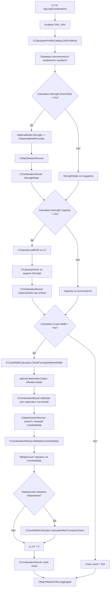
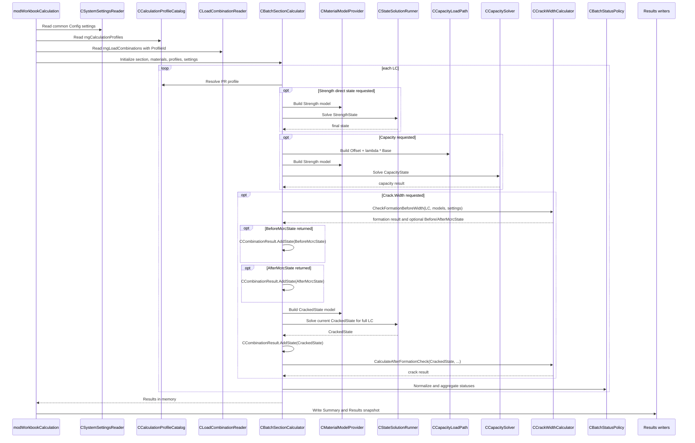
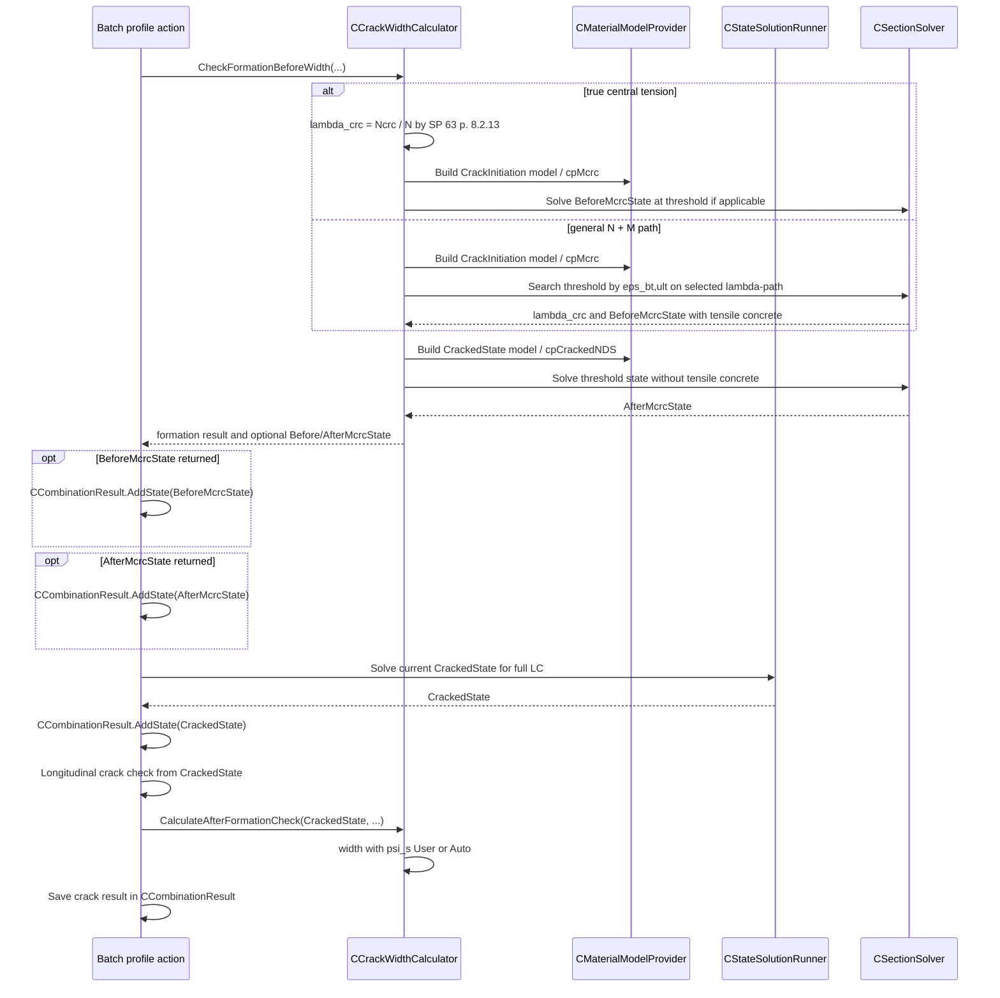

# Архитектура расчетных профилей и единого batch-конвейера

Документ фиксирует согласованную и реализованную архитектуру расчетных профилей для NDM. Описание привязано к текущим классам проекта и используется как контрольный контракт для Config, batch-конвейера, Results snapshot, схемы, AutoCAD export и тестов. Исторические замечания ниже описывают состояние до миграции только для понимания, какие старые ветви больше не должны возвращаться.

## 1. Цель Рефакторинга

До перехода на профили выбор расчетных сценариев был размазан по нескольким местам:

- `Calculation.Mode`;
- `Capacity.CalculationScope`;
- `SLS.Crack.Enabled`;
- `CalculationType` в `rngLoadCombinations`;
- `CapacityLoadPath` в `rngLoadCombinations`;
- `rngCalculationDiagramSettings`.

Из-за этого `CBatchSectionCalculator` одновременно отвечал за обход сочетаний, выбор физической модели, запуск solver-ов, запуск трещин, запуск несущей способности, статусы, governing и подготовку данных для writer-ов. Такой класс было трудно читать и опасно расширять: новая расчетная логика начинала появляться сразу в batch, writer-ах, plot/AutoCAD и настройках.

Цель рефакторинга:

- заменить глобальные расчетные переключатели профилем, назначенным конкретному сочетанию;
- оставить `CapacityLoadPath` в строке сочетания, потому что это свойство конкретного вектора нагрузок;
- убрать выбор расчетов из Excel-модулей и writer-ов;
- оставить `CBatchSectionCalculator` оркестратором, а не центром всех расчетных правил;
- хранить в памяти и на `Results` конечные именованные НДС: `StrengthState`, `CapacityState`, `BeforeMcrcState`, `AfterMcrcState`, `CrackedState`;
- сохранить текущую математику расчетов без изменения нормативных формул и solver API.

## 2. Зафиксированный frontend-контракт

### `rngCalculationProfiles`

`rngCalculationProfiles` имеет вертикальную структуру:

- параметры расположены по строкам;
- профили расположены по столбцам;
- заголовки столбцов `PR1`, `PR2`, `PR3`, `PR4` являются стабильными `ProfileId`;
- отдельных строк `ProfileId` и активности профиля нет;
- профиль считается настроенным, если заполнено `Profile.DisplayName` и все обязательные параметры для включенных расчетов;
- профиль используется только тогда, когда его `ProfileId` назначен сочетанию в `rngLoadCombinations`.

Оформление диапазона соответствует согласованному скриншоту: слева столбцы `Параметр` и `Key`, далее объединенная шапка `ProfileId` над колонками `PR1..PR4`, справа столбец `Комментарий`.

Шаблон книги по умолчанию содержит четыре профильных столбца `PR1..PR4`, но reader/catalog не привязан жестко к числу четыре. Код читает профильные столбцы динамически по заголовкам диапазона. Если в будущем в шаблон добавят `PR5`, расчетное ядро не должно требовать правки только из-за нового столбца.

Точная структура строк:

| Параметр | Key | PR1 default | PR2 default | PR3 default | PR4 default | Комментарий |
| --- | --- | --- | --- | --- | --- | --- |
| `[Общее]` |  |  |  |  |  | Раздел профиля. |
| Имя профиля | `Profile.DisplayName` | `Прочность` | `Трещины` | `Полный расчет` | `НДС` | Короткое имя профиля для пользователя. |
| Описание | `Profile.Description` | Проверка прочности и несущей способности | Проверка раскрытия трещин | Прочность, capacity и трещины | Только прямое НДС по прочности | Пояснение, когда профиль применять. |
| `[Запрашиваемые расчеты]` |  |  |  |  |  | Расчеты, которые профиль просит выполнить. |
| НДС по прочности | `Calculation.Strength.DirectState` | `Yes` | `No` | `Yes` | `Yes` | Прямое НДС по модели прочности. |
| Несущая способность | `Calculation.Strength.Capacity` | `Yes` | `No` | `Yes` | `No` | Поиск предельной несущей способности по `CapacityLoadPath` сочетания. |
| Раскрытие трещин | `Calculation.Crack.Width` | `No` | `Yes` | `Yes` | `No` | Расчет ширины раскрытия нормальных трещин. |
| Продольный изгиб | `Calculation.Stability.Enabled` | `No` | `No` | `No` | `No` | Учет продольного изгиба и проверка устойчивости перед последующими расчетами профиля. |
| `[Модель устойчивости]` |  |  |  |  |  | Набор характеристик материала для устойчивости без выбора диаграммы. |
| Характеристики материалов | `MaterialModel.Stability.ValueSet` | `ULS(I)` | `ULS(I)` | `ULS(I)` | `ULS(I)` | Для расчета устойчивости по СП используются расчетные характеристики I ГПС: бетон `Rb/Rbt`, арматура `Rsc/Rs`. |
| `[Модель прочности]` |  |  |  |  |  | Материальная модель для `StrengthState` и `CapacityState`. |
| Характеристики материалов | `MaterialModel.Strength.ValueSet` | `ULS(I)` | `ULS(I)` | `ULS(I)` | `ULS(I)` | Для прочности по СП используются характеристики I ГПС: бетон `Rb/Rbt`, арматура `Rsc/Rs`. |
| Диаграмма бетона | `MaterialModel.Strength.ConcreteDiagram` | `TwoLine` | `TwoLine` | `TwoLine` | `TwoLine` | СП 63, п. 6.1.23: для прочности применяется двух- или трехлинейная диаграмма бетона. |
| Растянутый бетон | `MaterialModel.Strength.ConcreteTension` | `Ignore` | `Ignore` | `Ignore` | `Ignore` | СП 63, п. 8.1.20: при расчете прочности растянутый бетон допускается не учитывать. |
| Диаграмма арматуры | `MaterialModel.Strength.SteelDiagram` | `TwoLine` | `TwoLine` | `TwoLine` | `TwoLine` | СП 63, п. 6.2.13: `TwoLine` для физического предела текучести, `ThreeLine` для условного. |
| `[Модель образования трещин]` |  |  |  |  |  | Модель образования нормальной трещины внутри `Calculation.Crack.Width`. |
| Характеристики материалов | `MaterialModel.CrackInitiation.ValueSet` | `SLS(II)` | `SLS(II)` | `SLS(II)` | `SLS(II)` | Для проверки образования нормальной трещины используются характеристики II ГПС: `Rb,ser/Rbt,ser` и `Rs,ser`. |
| Диаграмма бетона | `MaterialModel.CrackInitiation.ConcreteDiagram` | `ThreeLine` | `ThreeLine` | `ThreeLine` | `ThreeLine` | СП 63, п. 6.1.24: для образования трещин основная модель бетона - `ThreeLine` с растяжением. |
| Растянутый бетон | `MaterialModel.CrackInitiation.ConcreteTension` | `UseDiagram` | `UseDiagram` | `UseDiagram` | `UseDiagram` | Для стадии образования трещины растянутая ветвь бетона должна учитываться. |
| Диаграмма арматуры | `MaterialModel.CrackInitiation.SteelDiagram` | `TwoLine` | `TwoLine` | `TwoLine` | `TwoLine` | СП 63, п. 6.2.13: `TwoLine` для физического предела текучести, `ThreeLine` для условного. |
| `[Модель НДС с трещинами]` |  |  |  |  |  | Модель раскрытого состояния внутри `Calculation.Crack.Width`. |
| Характеристики материалов | `MaterialModel.CrackedState.ValueSet` | `SLS(II)` | `SLS(II)` | `SLS(II)` | `SLS(II)` | Для раскрытия трещин по СП используются характеристики II ГПС. |
| Диаграмма бетона | `MaterialModel.CrackedState.ConcreteDiagram` | `TwoLine` | `TwoLine` | `TwoLine` | `TwoLine` | СП 63, п. 6.1.26: после образования трещин НДС допускается считать по `TwoLine` или `ThreeLine`. |
| Растянутый бетон | `MaterialModel.CrackedState.ConcreteTension` | `Ignore` | `Ignore` | `Ignore` | `Ignore` | Для уже образовавшейся трещины растянутый бетон в НДС не учитывается. |
| Диаграмма арматуры | `MaterialModel.CrackedState.SteelDiagram` | `TwoLine` | `TwoLine` | `TwoLine` | `TwoLine` | СП 63, п. 6.2.13: `TwoLine` для физического предела текучести, `ThreeLine` для условного. |
| `[Настройки визуализации]` |  |  |  |  |  | Что показывать на схеме и в AutoCAD для выбранного LC. |
| Выводимое состояние | `Visualization.State` | `StrengthState` | `CrackedState` | `StrengthState` | `StrengthState` | Имя конечного состояния, которое схема/AutoCAD будут искать в snapshot. |
| Выводимая величина | `Visualization.Quantity` | `Stress` | `Stress` | `Stress` | `Strain` | `Stress` или `Strain`. |

Заполненность профиля не означает автоматический запуск. Профиль используется только тогда, когда его `ProfileId` назначен сочетанию.

### `rngLoadCombinations`

В таблице сочетаний `CalculationType` заменен на `ProfileId`.

Целевая структура:

| Поле | Назначение |
| --- | --- |
| `CombinationID` | Номер сочетания. |
| `N` | Продольная сила в пользовательских единицах и знаках. |
| `Mx` | Момент относительно X в пользовательских единицах и знаках. |
| `My` | Момент относительно Y в пользовательских единицах и знаках. |
| `ProfileId` | Заголовок профильного столбца из `rngCalculationProfiles`; в базовом шаблоне это `PR1`, `PR2`, `PR3` или `PR4`. |
| `CapacityLoadPath` | λ-траектория для несущей способности именно этого сочетания. |
| `Comment` | Комментарий пользователя. |

`CapacityLoadPath` остается в сочетании. Его нельзя переносить в профиль, потому что два сочетания с одним профилем могут требовать разных λ-траекторий.

### Общие настройки

Вне профилей остаются настройки, которые не являются выбором расчетного сценария:

- единицы;
- система знаков;
- геометрия;
- материалы;
- численные настройки solver-а;
- настройки поиска несущей способности;
- параметры методики трещин;
- настройки схемы;
- настройки AutoCAD.

Профиль отвечает на вопрос "какие расчеты запросил пользователь для этого LC". Общие настройки отвечают на вопрос "с какими материалами, геометрией, единицами и численными параметрами считать".

### `rngNDMElementResults`

Обязательная базовая структура:

```text
RunID
LoadCase
ProfileId
StateType
ElementID
Strain
Stress, MPa
PhysicalState
```

`rngNDMElementResults` является snapshot ровно одного расчетного запуска. Перед записью нового расчета старый snapshot полностью очищается. `RunID` можно сохранить как существующее служебное поле для трассировки, но схема и AutoCAD не обязаны фильтровать несколько `RunID`: в таблице не должно одновременно находиться данных разных запусков.

`LoadCase` не переименовывается в `CombinationID` без отдельного решения, потому что это уже существующее поле snapshot и его читают схема/AutoCAD.

В таблицу записываются только фактически полученные конечные именованные НДС:

- `StrengthState`, если включен `Calculation.Strength.DirectState`;
- `CapacityState`, если включен `Calculation.Strength.Capacity` и найдено предельное состояние;
- `CrackedState`, если включен `Calculation.Crack.Width` и текущее раскрытое состояние полного LC успешно найдено;
- `BeforeMcrcState`, если проверка образования нормальной трещины нашла пороговую точку с работающим растянутым бетоном;
- `AfterMcrcState`, если для найденной пороговой точки успешно решено состояние сразу после появления трещины без растянутого бетона.

Не записываются:

- промежуточные итерации solver-а;
- probe-точки Capacity;
- line search;
- неудачные состояния, которые не являются итоговым НДС.

Дополнительные колонки `MaterialModelRole`, `StateStatus`, `ExtensionUsed` не добавляются автоматически. Для каждой из них перед реализацией нужно отдельно доказать:

- какой snapshot-потребитель ее использует;
- почему значение нельзя надежно получить из уже сохраненных данных;
- почему оно должно повторяться в каждой поэлементной строке;
- нельзя ли сохранить его компактнее в заголовочной таблице состояний.

Формат `rngBatchSummary` в этом документе не проектируется.

### Схема и AutoCAD

Схема сечения и AutoCAD строятся только по сохраненному snapshot на листе `Results`.

Запрещены:

- передача результатов напрямую из in-memory `CCombinationResult`;
- fallback на текущий batch-объект;
- повторный вызов solver-а;
- восстановление отсутствующего состояния расчетом;
- использование результата предыдущего запуска вне выбранного snapshot.

Из `Config` разрешается читать только управляющие настройки выбора. `CombinationID` берется из текущего Config в разделах `[Схема сечения]` или `[AutoCAD export]`. Затем по выбранному `LoadCase` из `rngNDMElementResults` читается сохраненный `ProfileId`. По этому `ProfileId` из текущего `rngCalculationProfiles` читаются только `Visualization.State` и `Visualization.Quantity`. Все численные `Strain`, `Stress`, `PhysicalState`, `StateType` и необходимые признаки состояния должны браться только из snapshot.

Если пользователь после расчета поменял `Visualization.State` или `Visualization.Quantity`, программа не пересчитывает сечение. Она просто пытается выбрать другое уже существующее состояние или другую уже сохраненную величину из snapshot. Если нужного состояния нет, выводится понятное сообщение.

Старая настройка `AutoCAD.Export.ResultType` удалена, потому что она дублировала `Visualization.Quantity`. Аналогичная отдельная настройка схемы для выбора `Stress/Strain` также не используется: выводимая величина берется из профиля. `CombinationID` для схемы и AutoCAD при этом остается отдельной управляющей настройкой.

Если выбранное `Visualization.State` отсутствует в snapshot, нужно вывести понятное сообщение и ничего не пересчитывать. Для отсутствующих `BeforeMcrcState` и `AfterMcrcState` отдельно пояснять, что пороговое состояние образования трещины для выбранного LC неприменимо или не было найдено.

## 3. Исторические Проблемы До Миграции

### `CBatchSectionCalculator`

До профильной миграции этот класс был перегружен. Он:

- хранит входные сочетания и массив `CCombinationResult`;
- читает и использует `Calculation.Mode`;
- хранит scope расчета несущей способности;
- хранит глобальное включение трещин;
- выбирает, какие расчеты запускать для старых `Group1`/`Group2`;
- строит `CCapacityLoadPath`;
- запускает `CStateSolutionRunner`;
- запускает `CCapacitySolver`;
- запускает `CCrackWidthCalculator`;
- запускает проверку продольных трещин;
- агрегирует пользовательские статусы;
- определяет governing;
- отдает writer-ам большое количество отдельных getter-ов.

Методы, которые показывают смешение ответственностей:

- `Execute`;
- `RunCombination`;
- `RunSectionStateAndCrack`;
- `RunCapacity`;
- `ShouldRunCapacity`;
- `ShouldRunCrackWidth`;
- `MaterialPurposeForCombination`;
- `StoreCapacityOnlyStateAndCrack`;
- многочисленные getter-ы для Summary и snapshot.

В текущей архитектуре batch обходит LC, получает профиль и запускает действия профиля. Он не решает через старые группы, когда включать трещины и какие модели диаграмм использовать: это задано полями профиля.

### `CLoadCombinationReader`

Reader читает `ProfileId`, проверяет, что поле заполнено, и передает его в batch. Он не интерпретирует сам профиль.

### `CMaterialModelProvider`

`CMaterialModelProvider` является единой точкой получения диаграмм. Старый `rngCalculationDiagramSettings` удален из расчетного конвейера.

Provider получает спецификацию материальной модели из профиля:

```text
ValueSet + ConcreteDiagram + ConcreteTension + SteelDiagram
```

Решатели не выбирают `ULS(I)/SLS(II)`, `TwoLine/ThreeLine` или режим растянутого бетона. Они получают готовые диаграммы.

### `CNDMResultsWriter`

Writer пишет все конечные named states. Одно сочетание может дать `StrengthState`, `CapacityState`, `CrackedState`, а при найденной точке образования трещины дополнительно `BeforeMcrcState` и/или `AfterMcrcState`.

Writer добавляет колонку `StateType` и не пишет промежуточные solver/probe-состояния.

### `CSectionPlotDataReader` и `modAutoCADStressExport`

Эти компоненты уже движутся в правильную сторону, потому что читают `Results`. Но сейчас им достаточно `LoadCase`. После перехода на несколько состояний на LC они должны читать из текущего профиля управляющий выбор `Visualization.State`, а фактические строки нужного `StateType` брать только из snapshot.

Важно: схема и AutoCAD остаются потребителями snapshot, а не расчетными участниками.

## 4. Термины

### `ProfileId`

Стабильный ключ профиля. В интерфейсе это заголовок столбца `PR1`, `PR2`, `PR3` или `PR4`.

Код не должен ветвиться по `ProfileId` или `DisplayName`. После чтения профиля логика должна работать с его полями: флагами расчетов, спецификациями материальных моделей и настройками визуализации.

### `CalculationKind`

Тип запрошенного расчетного действия. В целевой структуре профиля явно существуют три запрашиваемых расчета:

- `Calculation.Strength.DirectState`;
- `Calculation.Strength.Capacity`;
- `Calculation.Crack.Width`.

Проверка продольных трещин не является отдельным видом расчета профиля. Она выполняется внутри `Calculation.Crack.Width`, потому что относится к трещиностойкости и использует тот же контекст II группы и уже рассчитанные напряжения бетона.

Профиль определяет только, что пользователь просит посчитать. Он не задает порядок выполнения и зависимости между расчетами. Порядок `StrengthState` / `CapacityState` / `CrackedState`, проверка образования трещины, переиспользование уже найденных состояний и запрет повторного solve одного и того же состояния являются ответственностью расчетного orchestrator-а.

### `MaterialModelRole`

Смысловая роль материальной модели:

- `Strength` - модель прочности;
- `CrackInitiation` - модель образования нормальной трещины;
- `CrackedState` - модель НДС с трещинами.

Эта роль не должна записываться в `rngNDMElementResults` автоматически. В памяти она нужна, чтобы выбрать правильную спецификацию профиля и получить диаграммы через `CMaterialModelProvider`.

### `StateType`

Явное имя конечного НДС:

- `StrengthState`;
- `CapacityState`;
- `BeforeMcrcState`;
- `AfterMcrcState`;
- `CrackedState`.

Состояния для будущей устойчивости сейчас не добавляются и не резервируются.

`StateType` записывается в `rngNDMElementResults` и используется схемой/AutoCAD для выбора состояния из snapshot.

### `CalculationPurpose`

В текущем коде есть enum `ECalculationPurpose` в `modCalculationPurpose.bas`. Его можно временно сохранить на этапе миграции как внутренний тип provider-а, но он не должен быть пользовательским выбором расчета.

В целевой архитектуре его смысл фактически должен соответствовать роли материальной модели:

- `Strength`;
- `CrackInitiation`;
- `CrackedState`.

Он не является типом пользовательского расчета. Пользовательский профиль выбирает расчеты и спецификации моделей, а solver получает уже готовую диаграмму.

### Result и CheckResult

`Result` - расчетные величины: найденная плоскость деформаций, λ, предельные усилия, ширина раскрытия трещины, напряжения, зоны, коэффициенты.

`CheckResult` - статус и итог проверки: `OK`, `FAIL`, `NumFail`, `InputErr`, `N/A`, запас, причина неприменимости или диагностическое сообщение.

### Внутреннее состояние и конечное именованное состояние

Внутреннее состояние - проба solver-а, шаг line search, точка бискекции, рестарт, warm-start. Оно не пишется в `rngNDMElementResults`.

Конечное именованное состояние - состояние, которое является итогом расчетного действия и может быть показано пользователю. Только такие состояния пишутся в snapshot.

## 5. Точная backend-модель профиля

`CCalculationProfile` должен напрямую отражать `rngCalculationProfiles`.

Рекомендуемые поля:

```text
ProfileId As String
DisplayName As String
Description As String

StrengthDirectStateEnabled As Boolean
StrengthCapacityEnabled As Boolean
CrackWidthEnabled As Boolean

StrengthModel As CMaterialModelSpec
CrackInitiationModel As CMaterialModelSpec
CrackedStateModel As CMaterialModelSpec

VisualizationState As ESectionStateType
VisualizationQuantity As EVisualizationQuantity
```

`CMaterialModelSpec`:

```text
ValueSet As EMaterialValueSet
ConcreteDiagram As EConcreteDiagramType
ConcreteTension As EConcreteTensionMode
SteelDiagram As ESteelDiagramType
```

Почему нужен отдельный `CMaterialModelSpec`: три модели имеют одинаковый набор полей. Если хранить их отдельными строковыми полями прямо в `CCalculationProfile`, класс быстро станет нечитаемым, а provider будет получать разрозненные параметры.

`CCalculationProfile` не содержит признака активности. Даже полностью заполненный профиль не участвует в расчете, пока его `ProfileId` не выбран в сочетании.

## 6. Enums и стабильные машинные значения

### `EMaterialValueSet`

```text
mvsULS
mvsSLS
```

`ULS(I)` и `SLS(II)` выбирают набор характеристик материала для I и II групп предельных состояний. Они не являются профилями. Старые текстовые значения `ULS`, `SLS`, `I(ULS)` и `II(SLS)` можно читать как алиасы при миграции, но в книге пользователь видит запись с группой.

### `EConcreteDiagramType`

```text
cdTwoLine
cdThreeLine
```

### `EConcreteTensionMode`

```text
ctIgnore
ctUseDiagram
```

### `ESteelDiagramType`

```text
sdTwoLine
sdThreeLine
```

### `ESectionStateType`

```text
sstStrengthState
sstCapacityState
sstBeforeMcrcState
sstAfterMcrcState
sstCrackedState
```

### `EVisualizationQuantity`

```text
vqStress
vqStrain
```

### `EUserStatus`

Пользовательские статусы должны оставаться централизованными в `CBatchStatusPolicy`:

```text
OK
FAIL
NumFail
InputErr
N/A
```

Другие классы могут возвращать внутренние причины, но не должны самостоятельно собирать пользовательские строки статуса.

### `ECapacityLoadPath`

`CapacityLoadPath` можно позже типизировать:

```text
clpLambdaMx
clpLambdaMy
clpLambdaMxy
clpLambdaN
clpLambdaNMxy
```

Это отдельная задача. Сейчас важно, что `CCapacityLoadPath` уже должен оставаться единственной точкой интерпретации λ-траектории.

## 7. Целевые ответственности классов

### `CBatchSectionCalculator`

Оставить как оркестратор batch.

Что остается:

- цикл по LC;
- получение `CCalculationProfile` по `ProfileId`;
- вызов расчетных компонентов в централизованном порядке orchestrator-а;
- хранение массива/коллекции `CCombinationResult`;
- governing по уже посчитанным результатам;
- вызов `CBatchStatusPolicy` для итоговых статусов.

Что выносится или удаляется:

- глобальный выбор режима расчета;
- глобальный scope несущей способности;
- глобальное включение трещин;
- выбор материальной модели по старой строковой группе;
- решение, какие проверки относятся к первой или второй группе;
- логика старого отдельного вывода на лист `Расчет`.

При текущих трех флагах профиля не нужен отдельный `CCalculationPlanBuilder`: он добавит формальную прослойку без реального выигрыша. Batch/orchestrator может сам централизованно пройти фиксированный порядок `Strength.DirectState -> Strength.Capacity -> Crack.Width`, переиспользуя уже полученные состояния и не допуская повторного solve одного и того же состояния.

### `CCalculationProfile`

Новый объект входных данных профиля. Он хранит только то, что есть в `rngCalculationProfiles`, в типизированном виде.

Он не выполняет расчет, не читает Excel и не знает о конкретных сочетаниях.

### `CCalculationProfileCatalog`

Небольшой каталог профилей. Нужен для:

- поиска профиля по заголовку профильного столбца;
- проверки заполненности выбранного профиля;
- запрета ветвления по имени профиля в batch;
- выдачи понятной ошибки, если LC ссылается на пустой или неполный профиль.

Каталог не должен иметь зашитого ограничения на четыре профиля. `PR1..PR4` - стартовый шаблон книги, а не предел архитектуры.

### `CMaterialModelSpec`

Новый компактный объект спецификации материальной модели. Он нужен, чтобы одинаково передавать в `CMaterialModelProvider` настройки моделей прочности, образования трещины и раскрытого состояния.

### `CLoadCombinationReader`

Изменить:

- читать `ProfileId` вместо `CalculationType`;
- оставить чтение `CapacityLoadPath`;
- не интерпретировать профиль;
- передавать batch уже нормализованные усилия в расчетных единицах.

### `CMaterialModelProvider`

Оставить единой точкой получения готовых диаграмм.

Изменить:

- получать `CMaterialModelSpec`, а не читать старые ключи диаграмм;
- строить бетонную и арматурную диаграмму по `ValueSet`, типу диаграммы и режиму растянутого бетона;
- сохранять numerical extension только там, где он уже принят для прямого поиска состояния, не расширяя физические расчеты Capacity/CrackInitiation/CrackedState.

### `CStateSolutionRunner`

Оставить как runner прямого состояния.

Он должен:

- получать готовые диаграммы от provider-а;
- управлять solve/retry/warm-start;
- взаимодействовать с `CStateGuessBuilder`;
- возвращать состояние для `CCombinationResult`.

### `CStateGuessBuilder`

Оставить builder-ом стартовой плоскости. Он не должен выбирать профиль или пользовательский статус.

### `CCapacityLoadPath`

Оставить универсальной сущностью λ-траектории:

```text
Target(lambda) = Offset + lambda * Base
```

Все признаки вроде наличия масштабируемой силы, моментов и силовой осевой траектории должны жить здесь, а не отдельными private-ветками в batch.

### `CCapacitySolver`

Оставить математическим solver-ом несущей способности. Он получает:

- готовый `CCapacityLoadPath`;
- готовые физические диаграммы;
- численные настройки.

Он не знает о профилях, Excel, `PR1/PR2` и пользовательских статусах.

### `CCrackWidthCalculator`

Оставить расчетчиком `Calculation.Crack.Width`.

Внутри этого расчета:

- calculator сначала проверяет факт образования нормальной трещины по модели `CrackInitiation`;
- путь проверки задается `SLS.Crack.InitiationLoadPath`: `Auto`, `λ*Mxy`, `λ*N` или `λ*NMxy`;
- численная стратегия проверки задается `SLS.Crack.InitiationSolutionStrategy`: `Auto`, `UltimateStrain` или `LoadMultiplier`;
- при найденной пороговой точке calculator возвращает optional `BeforeMcrcState` и `AfterMcrcState`;
- текущее `CrackedState` полного LC решает orchestrator через `CStateSolutionRunner`, сохраняет его в snapshot и передает calculator-у только для расчета ширины;
- calculator считает и возвращает crack-result, но не знает о `CCombinationResult` и не модифицирует его напрямую;
- проверка продольных трещин вызывается в том же конвейере трещин после получения напряжений бетона раскрытого состояния;
- итог продольных трещин хранится в `CCombinationResult` как часть результата Crack.Width, а не как самостоятельный расчет профиля.

### `CBatchStatusPolicy`

Оставить единственной точкой пользовательских статусов:

- нормализация внутренних причин;
- статусы отдельных расчетов;
- общий статус LC;
- расшифровка статусов для Results и `Справка`.

### `CCombinationResult`

Оставить и расширить:

- хранить `ProfileId`;
- хранить статусы расчетов;
- хранить результаты Strength/Capacity/Crack;
- хранить итог продольных трещин внутри crack-результатов;
- хранить коллекцию конечных named states типа `CSectionStateResult`.

### `CSectionStateResult`

Зафиксировать как часть целевой архитектуры. Один LC теперь штатно может иметь несколько конечных именованных НДС, поэтому хранить их отдельными параллельными полями в `CCombinationResult` нельзя.

Минимальный смысл:

```text
StateType
MaterialModelRole
MaterialModelSpec
Epsilon0
KappaX
KappaY
ExtensionUsed
StopReason
служебный status, если он нужен последующим этапам
```

`MaterialModelRole` остается смысловой меткой состояния: `Strength`, `CrackInitiation` или `CrackedState`.

`MaterialModelSpec` фиксирует фактически использованную спецификацию модели:

- `ValueSet`;
- `ConcreteDiagram`;
- `ConcreteTension`;
- `SteelDiagram`.

Обе части нужны одновременно. `MaterialModelRole` объясняет инженерный смысл состояния, а `MaterialModelSpec` защищает snapshot от неоднозначности: два разных профиля могут использовать одну и ту же роль, но разные типы диаграмм или разные наборы характеристик.

`CSectionStateResult` должен хранить достаточно информации, чтобы writer однозначно воспроизвел именно рассчитанную плоскость деформаций и именно ту материальную модель, с которой это состояние было получено. `CNDMResultsWriter` должен строить напряжения по `MaterialModelSpec`, сохраненной вместе со state, а не восстанавливать модель только по `MaterialModelRole` или текущему Config.

Это не означает автоматического добавления всех этих полей в `rngNDMElementResults`: snapshot-колонки надо добавлять только после анализа реальных потребителей.

### `CBatchResultWriter`

Изменить позже, но не проектировать новый Summary в этом документе.

Writer должен читать готовые `CCombinationResult` и не решать, какие расчеты должны были выполняться.

### `CNDMResultsWriter`

Изменить:

- писать все конечные named states;
- добавить базовые колонки `ProfileId` и `StateType`;
- воспроизводить `Stress` по `MaterialModelSpec`, сохраненной в `CSectionStateResult`;
- писать `rngNDMMaterialDiagrams` как уникальный каталог `DiagramId`, а не как повторение одних и тех же точек по каждому LC;
- сохранять в `rngNDMSectionProperties` ссылки `ConcreteDiagramId` и `RebarDiagramId` для каждого named-state;
- не восстанавливать материальную модель только по `MaterialModelRole` или текущему `Config`;
- не писать внутренние пробы solver-а.

### `CSectionPlotDataReader` и `modAutoCADStressExport`

Изменить:

- выбирать данные по `LoadCase` + `StateType`;
- брать требуемое состояние из snapshot;
- не обращаться к in-memory результатам batch;
- не пересчитывать отсутствующие состояния.

## 8. Таблица зависимостей "сейчас" и "после"

| Участок | Сейчас | После |
| --- | --- | --- |
| Выбор расчетов | Несколько глобальных переключателей и `CalculationType` | `ProfileId` в LC + поля `rngCalculationProfiles` |
| Идентификатор профиля | Старой сущности нет | Заголовки `PR1..PR4` |
| Диаграммы | Старый отдельный диапазон диаграмм | Три спецификации моделей внутри профиля |
| Direct Strength State | Запускается по глобальному режиму и старой группе | Запускается по `Calculation.Strength.DirectState` |
| Capacity | Запускается по глобальному scope | Запускается по `Calculation.Strength.Capacity`; path берется из LC |
| Crack.Width | Глобальное включение + старая группа | Запускается по `Calculation.Crack.Width` |
| Продольные трещины | Сейчас вызываются в batch рядом с трещинами | Остаются частью `Calculation.Crack.Width` |
| Элементные результаты | Одно состояние на LC | Все конечные named states с колонкой `StateType` |
| Диаграммы Results | Повторение диаграмм по сочетаниям | Уникальный каталог `DiagramId` по `ProfileId`/`StateType`/`MaterialModelSpec`; named-state metadata хранит ссылки на бетонную и арматурную диаграмму |
| Plot/AutoCAD | По `LoadCase` без явного состояния | `LoadCase` из Config, `Visualization.State` из текущего профиля, численные данные из snapshot |
| Статусы | Частично в batch, частично рядом с расчетами | Пользовательские строки только через `CBatchStatusPolicy` |

## 9. Flow одного сочетания



## 10. Flow полного batch



## 11. Последовательность `Calculation.Crack.Width`

`Calculation.Crack.Width` - самостоятельный запрашиваемый расчет профиля. Но его внутренние состояния не являются отдельными переключателями профиля.

Владелец текущего `CrackedState` полного LC - расчетный orchestrator, то есть `CBatchSectionCalculator`:

```text
CBatchSectionCalculator
-> CCrackWidthCalculator.CheckFormationBeforeWidth(...)
-> CCombinationResult.AddState(BeforeMcrcState/AfterMcrcState, если получены)
-> MaterialModel.CrackedState
-> CStateSolutionRunner
-> CrackedState
-> CCombinationResult.AddState(CrackedState)
-> CCrackWidthCalculator.CalculateAfterFormationCheck(CrackedState, если трещина образована)
```

`CCrackWidthCalculator` не должен сам повторно решать текущее `CrackedState` заданного LC. Он получает готовое раскрытое НДС и использует его для зоны, `sigma_s`, `As`, `Abt`, `ds`, `ls` и проверки ширины раскрытия.

Перед расчетом ширины `CCrackWidthCalculator` всегда проверяет факт образования нормальной трещины. В центральной ветке `lambda_crc` берется из `Ncrc / N`; в общей ветке точка ищется по выбранной `SLS.Crack.InitiationLoadPath`. Если пороговая точка найдена, calculator формирует `BeforeMcrcState` по модели `CrackInitiation`, затем решает `AfterMcrcState` по модели `CrackedState` на том же уровне нагрузки. В режиме `PsiMode = Auto` уже найденный `AfterMcrcState` используется для `sigma_s,crc`; повторно искать пороговую точку на этом шаге не нужно.

Единое правило сохранения состояний: calculator считает и возвращает результат, а named states в `CCombinationResult` добавляет только orchestrator. Поэтому `CCrackWidthCalculator` не должен иметь зависимости от `CCombinationResult`.

### User

```text
1. Orchestrator вызывает `CCrackWidthCalculator.CheckFormationBeforeWidth`.
2. Calculator проверяет факт образования нормальной трещины по `MaterialModel.CrackInitiation`.
3. Если пороговая точка найдена, calculator возвращает `BeforeMcrcState` и `AfterMcrcState`.
4. Orchestrator сохраняет найденные состояния образования трещины в `CCombinationResult.States`.
5. Orchestrator через `CStateSolutionRunner` получает текущее `CrackedState` для полного LC.
6. Orchestrator сохраняет `CrackedState` в `CCombinationResult.States`.
7. По `CrackedState` выполняется проверка продольных трещин.
8. Если нормальная трещина образуется, calculator считает ширину раскрытия по текущему `CrackedState`.
9. Если нормальная трещина не образуется, ширина принимается равной 0, но `CrackedState` остается в snapshot.
10. Orchestrator сохраняет crack-result в `CCombinationResult`.
```

### Нормальная трещина не образуется

```text
1. Проверка образования возвращает lambda_crc > 1 или отсутствие действия, способного вызвать нормальную трещину.
2. Ширина нормальной трещины не считается как раскрытая трещина: a_crc = 0.
3. Текущее CrackedState полного LC все равно решается и записывается.
4. Проверка продольных трещин выполняется по CrackedState, если применима.
```

### Нормальная трещина образуется



Подробная последовательность для общей ветки с изгибной или
внецентренно-растянутой эпюрой:

```text
1. По `SLS.Crack.InitiationLoadPath` выбирается, какая часть LC масштабируется:
   `λ*Mxy`, `λ*N`, `λ*NMxy` или последовательный `Auto`.
2. По `SLS.Crack.InitiationSolutionStrategy` выбирается численный способ:
   `UltimateStrain`, `LoadMultiplier` или `Auto`.
3. С материалами `MaterialModel.CrackInitiation` / `cpMcrc` определяется
   `lambda_crc` и состояние образования трещины по критерию достижения
   предельной растягивающей деформации бетона `eps_bt,ult`
   по СП 63 п. 8.2.14 и п. 8.1.30.

   - при двузначной эпюре принимается `eps_bt,ult = eps_bt2`;
   - при однозначно растянутой эпюре с ненулевой кривизной применяется
     формула (8.54):
     `eps_bt,ult = eps_bt2 - (eps_bt2 - eps_bt0) * eps1 / eps2`;

4. Это состояние является `BeforeMcrcState`: физическое состояние
   образования трещины с учетом растянутого бетона. Если пороговая точка
   успешно найдена, calculator возвращает его orchestrator-у. Orchestrator
   добавляет его в
   `CCombinationResult.States`, а затем writer записывает его в
   `rngNDMElementResults` как `StateType = BeforeMcrcState`.

5. После нахождения `lambda_crc` выполняется отдельный solve для
   найденной нагрузки уже по `MaterialModel.CrackedState` /
   `cpCrackedNDS`, то есть без растянутого бетона.

6. Это состояние является `AfterMcrcState`: НДС сразу после образования
   трещины на той же нагрузке, но уже с выключенным растянутым бетоном. Если
   solve успешно выполнен, calculator возвращает это состояние orchestrator-у.
   Orchestrator добавляет его в
   `CCombinationResult.States`, а writer записывает его в
   `rngNDMElementResults` как `StateType = AfterMcrcState`.

7. Именно из `AfterMcrcState` определяется `sigma_s,crc`, чтобы пользователь
   мог вручную проверить напряжение арматуры после раскрытия.

8. Затем вычисляется `psi_s = 1 - 0.8 * sigma_s,crc / sigma_s`, если
   `SLS.Crack.PsiMode = Auto` и первая проверка ширины с `psi_s = 1`
   не прошла.
```

Для истинного центрального растяжения эта последовательность короче и
нормативно отделена от изгибного поиска:

```text
1. Проверяется растягивающая продольная сила N и нулевые Mx/My относительно
   центра тяжести приведенного сечения, выбранного для расчета Ncrc.
2. По СП 63 п. 8.2.13, формула (8.127), считается Ncrc = Ared * Rbt,ser.
3. Если N <= Ncrc, трещина при текущей нагрузке не считается образованной.
4. Если N > Ncrc, принимается lambda_crc = Ncrc / N.
5. Для получения sigma_s,crc выполняется отдельный solve найденного уровня
   по MaterialModel.CrackedState / cpCrackedNDS без растянутого бетона.
6. Полученное состояние calculator возвращает как AfterMcrcState, а
   orchestrator сохраняет его в CCombinationResult.States. Если текущая
   реализация также сформировала BeforeMcrcState для единого snapshot-а,
   writer записывает его как служебное состояние порога.
```

Важно различать два состояния:

- `BeforeMcrcState` - именованное состояние образования трещины по модели CrackInitiation. Оно возвращается calculator-ом и сохраняется orchestrator-ом, если реально была найдена пороговая точка с работающим растянутым бетоном.
- `AfterMcrcState` - именованное состояние сразу после образования трещины по модели `CrackedState`. Оно обязательно возвращается calculator-ом и сохраняется orchestrator-ом как конечное состояние, если реально было рассчитано; из него берется `sigma_s,crc`.

Итог продольных трещин хранится в `CCombinationResult` рядом с результатами Crack.Width: максимальное сжимающее напряжение бетона, допустимое `Rb,mc2`, запас и статус проверки. Отдельной строки профиля и отдельного расчетного действия для него не требуется.

## 12. Последовательность Capacity

Capacity запускается только если в профиле включен `Calculation.Strength.Capacity`.

Путь берется из строки LC:

```text
Target(lambda) = Offset + lambda * Base
```

| `CapacityLoadPath` | Что масштабируется | Что остается постоянным |
| --- | --- | --- |
| `λ*Mx` | пользовательский `Mx` | `N`, пользовательский `My`, моменты от эксцентриситета N |
| `λ*My` | пользовательский `My` | `N`, пользовательский `Mx`, моменты от эксцентриситета N |
| `λ*Mxy` | пользовательские `Mx` и `My` | `N`, моменты от эксцентриситета N |
| `λ*N` | `N` и моменты от эксцентриситета этой силы | пользовательские `Mx`, `My` |
| `λ*NMxy` | весь внутренний вектор `N`, `Mx`, `My` | ничего |

Псевдокод:

```text
If profile.StrengthCapacityEnabled Then
    spec = profile.StrengthModel
    materials = MaterialProvider.Build(spec)
    loadState = LoadStateForCombination(loadCase)
    path = New CCapacityLoadPath
    path.InitializeFromLoadState loadCase.CapacityLoadPath, loadState
    capacityResult = CCapacitySolver.Solve(path, materials, capacitySettings)
    combinationResult.StoreCapacity(capacityResult)
End If
```

`CCapacitySolver` не знает, из какого профиля пришел расчет. Он получает готовые материалы и готовый path.

## 13. In-memory хранение named states

Целевая структура:

```text
CCombinationResult
    LoadCase
    ProfileId
    Statuses
    Strength result fields
    Capacity result fields
    Crack result fields
    поля проверки продольных трещин внутри crack result
    States As Collection

CSectionStateResult
    StateType
    MaterialModelRole
    MaterialModelSpec
    Epsilon0
    KappaX
    KappaY
    ExtensionUsed
    StopReason
    service status/flags if needed by next calculation stages
```

`CSectionStateResult` является обязательной частью целевой архитектуры. Без него `CCombinationResult` снова превратится в набор параллельных полей для `StrengthState`, `CapacityState`, `CrackedState`, `BeforeMcrcState` и `AfterMcrcState`.

В памяти state должен хранить достаточно информации, чтобы writer мог однозначно воспроизвести именно рассчитанную плоскость деформаций и именно ту материальную модель, с которой это состояние было получено. Поэтому `MaterialModelRole` и `MaterialModelSpec` являются частью in-memory state. При этом `MaterialModelRole`, `MaterialModelSpec`, `StateStatus`, `ExtensionUsed` не обязаны автоматически попадать в каждую строку `rngNDMElementResults`: для snapshot сначала надо проверить, какой потребитель реально нуждается в этих признаках и нельзя ли хранить их компактнее в отдельной заголовочной таблице состояний.

Правила:

- `StrengthState` создается только для включенного `Calculation.Strength.DirectState`;
- `CapacityState` создается только при успешном получении предельного НДС;
- `CrackedState` создается внутри включенного `Calculation.Crack.Width`;
- `BeforeMcrcState` создается calculator-ом и сохраняется orchestrator-ом, если проверка образования трещины нашла пороговое состояние с работающим растянутым бетоном;
- `AfterMcrcState` обязательно создается calculator-ом и сохраняется orchestrator-ом, если после найденного `lambda_crc` успешно выполнен повторный solve по `CrackedState`;
- внутренние пробы не сохраняются;
- writer-ы получают states из `CCombinationResult`, а не запускают solver.

## 14. `rngNDMElementResults`: правила заполнения

`rngNDMElementResults` хранит данные только одного последнего расчетного запуска. Перед новой записью writer полностью очищает старые строки snapshot. Поэтому `RunID` остается служебной меткой текущего запуска, но не превращает таблицу в историю расчетов.

Псевдокод:

```text
rows = []

For each result in batch.Results
    For each state in result.FinalStates
        materialModel = MaterialProvider.Build(state.MaterialModelSpec)

        For each section element
            epsilon = state.Epsilon0 + state.KappaX * y + state.KappaY * x
            stress = materialModel.StressAtStrain(element, epsilon)
            physicalState = physical coloring state for this element

            rows.Add RunID,
                     result.LoadCase,
                     result.ProfileId,
                     state.StateType,
                     element.ElementID,
                     epsilon,
                     stress,
                     physicalState
        Next
    Next
Next

Write rows to rngNDMElementResults as one block
```

Если writer-у для восстановления `stress` нужна роль материальной модели, сначала нужно рассмотреть компактную таблицу заголовков состояний, например:

```text
RunID | LoadCase | ProfileId | StateType | MaterialModelSpecKey | Status | ExtensionUsed
```

И только если такой таблицы недостаточно конкретному snapshot-потребителю, добавлять дополнительные поля в каждую поэлементную строку.

## 15. Схема и AutoCAD

Псевдокод:

```text
selectedLoadCase = Config.PlotOrAutoCAD.CombinationID
profileId = ProfileId from rngNDMElementResults for selectedLoadCase
targetState = current rngCalculationProfiles(profileId).Visualization.State
targetQuantity = current rngCalculationProfiles(profileId).Visualization.Quantity

rows = rngNDMElementResults where LoadCase = selectedLoadCase
                             and StateType = targetState

If rows found Then
    Draw/export geometry + targetQuantity from snapshot rows
Else
    Draw/export geometry only if geometry snapshot exists
    Show clear message:
        selected state is absent in Results snapshot
End If
```

Для `BeforeMcrcState` и `AfterMcrcState` сообщение должно быть специальным: состояние отсутствует, потому что для выбранного LC не было действия, способного вызвать нормальную трещину, либо проверка образования трещины не нашла пороговую точку.

Plot/AutoCAD не должны использовать:

- текущий `CCombinationResult` из памяти;
- текущий batch-объект;
- текущие материалы Config для пересчета отсутствующих данных;
- fallback на результат предыдущего запуска вне текущего snapshot;
- solver.

## 16. Validation и diagnostics

### Проверка профилей

Каталог профилей должен проверять только выбранные профили. Блокирующие ошибки профиля:

- `Profile.DisplayName` заполнен;
- хотя бы один из трех расчетов включен;
- для включенного `Calculation.Strength.DirectState` заполнена модель прочности;
- для включенного `Calculation.Strength.Capacity` заполнена модель прочности;
- для включенного `Calculation.Crack.Width` всегда заполнена модель `CrackedState`;
- для включенного `Calculation.Crack.Width` и глобального `SLS.Crack.PsiMode = Auto` заполнена модель `CrackInitiation`;
- при `SLS.Crack.PsiMode = User` модель `CrackInitiation` может быть пустой и не должна блокировать расчет;
- `Visualization.Quantity` задана корректно как управляющее значение `Stress` или `Strain`.

Профиль с неполными обязательными параметрами не является ошибкой, пока он не назначен сочетанию.

### Проверка визуализации

`Visualization.State` не должен блокировать batch-расчет и не должен превращать профиль в `InputErr`.

Например, конфигурация:

```text
Calculation.Crack.Width = Yes
Visualization.State = BeforeMcrcState
```

допустима даже если:

- `SLS.Crack.PsiMode = User`;
- проверка образования трещины не нашла пороговую точку;
- в конкретном LC нет действия, способного вызвать нормальную трещину.

То же относится к `Visualization.State = AfterMcrcState`.

В таком случае все запрошенные расчеты выполняются и snapshot записывается нормально. Ошибка или предупреждение возникает только при попытке построения схемы/AutoCAD: запрашиваемое состояние не найдено в текущем snapshot. Для `BeforeMcrcState` и `AfterMcrcState` сообщение должно объяснять, что пороговое состояние образования трещины отсутствует, потому что для выбранного LC оно неприменимо или не было найдено.

Иными словами, `Visualization.State`, не соответствующий гарантированному состоянию профиля, является проблемой визуализации, а не расчетной ошибкой профиля.

### Проверка сочетаний

Reader и batch должны проверять:

- `ProfileId` заполнен;
- профиль существует и настроен;
- нагрузки числовые;
- если включена несущая способность, `CapacityLoadPath` допустим и имеет хотя бы одну масштабируемую компоненту.

### Диагностика

Подробные `StopReason`, итерации, численные причины и warnings остаются во внутренних diagnostics и txt-отчете. Пользовательские статусы формируются через `CBatchStatusPolicy`.

## 17. Что удаляется

После внедрения профилей подлежат удалению:

- `Calculation.Mode`;
- `Capacity.CalculationScope`;
- `SLS.Crack.Enabled`;
- `CalculationType` в таблице сочетаний;
- старый `rngCalculationDiagramSettings`;
- `AutoCAD.Export.ResultType`, потому что выводимая величина теперь задается через `Visualization.Quantity` профиля;
- аналогичная настройка схемы для выбора `Stress/Strain`, если при аудите она окажется дублем `Visualization.Quantity`;
- старые ключи диаграмм, если они заменены спецификациями моделей в `rngCalculationProfiles`;
- ветки batch, которые существуют только ради глобального режима книги;
- ветки writer-ов, которые самостоятельно решают, какие расчеты должны были выполняться;
- старый отдельный вывод расчетных результатов на лист `Расчет`, если он еще где-то остался.

Не сохранять старую архитектуру только ради совместимости. Если нужна миграция старой книги, делать ее однократно в build/migration-слое, а не в расчетном ядре.

## 18. План безопасной миграции

1. Зафиксировать текущий baseline коммитом.
2. Добавить `CMaterialModelSpec`.
3. Добавить `CCalculationProfile`.
4. Добавить `CCalculationProfileCatalog`.
5. Создать `rngCalculationProfiles` в книге строго по согласованной вертикальной структуре.
6. Перевести `CLoadCombinationReader` на `ProfileId`.
7. Передать catalog в `CBatchSectionCalculator`.
8. Перевести запуск расчетов в batch на поля профиля.
9. Добавить `CSectionStateResult` как обязательный объект конечного именованного НДС.
10. Расширить `CCombinationResult` коллекцией `CSectionStateResult`.
11. Перевести `CNDMResultsWriter` на `StateType`.
12. Перевести plot и AutoCAD на выбор `Visualization.State` из текущего профиля и чтение численных данных только из snapshot.
13. Перевести `CMaterialModelProvider` на `CMaterialModelSpec`.
14. Удалить старые глобальные настройки расчета и `AutoCAD.Export.ResultType`.
15. Обновить лист `Справка`.
16. Обновить тесты.
17. Пройти `rg` по удаляемым ключам и классам.
18. Запустить полную сборку и полный набор тестов.

## 19. Backward compatibility

Runtime-совместимость со старой моделью не нужна. Она вернет несколько источников истины.

Допустимо:

- в build-скрипте создать новые профили `PR1/PR2`;
- старые тестовые книги пересобрать;
- при отсутствии `rngCalculationProfiles` показывать понятную ошибку о необходимости обновить книгу.

Не допустимо:

- одновременно поддерживать старые глобальные настройки и профили в расчетном ядре;
- ветвиться по старым строкам групп;
- скрыто подставлять профиль по старому `CalculationType`.

## 20. Риски

- Неправильная миграция `PR1/PR2` может изменить набор выполняемых расчетов.
- Plot/AutoCAD могут показать не то состояние, если не будет строгого выбора по `StateType`.
- Writer element results должен получить ровно те состояния, которые реально были рассчитаны, без внутренних probe-состояний.
- `Calculation.Crack.Width` сложнее простого флага: внутри него всегда нужен `CrackedState` для полного LC, а `BeforeMcrcState` и `AfterMcrcState` появляются, когда проверка образования нормальной трещины нашла пороговую точку. Ширина нормальной трещины считается только если эта проверка показала, что трещина образуется при текущем сочетании.
- Если добавить лишние колонки в `rngNDMElementResults` без необходимости, snapshot раздуется и станет труднее поддерживать.
- Если оставить пользовательские статусы вне `CBatchStatusPolicy`, появятся разные варианты одинаковых статусов.

## 21. Stability extension

Устойчивость сейчас не реализуется и детально не проектируется. В этом документе не надо определять алгоритм устойчивости, порядок изменения `N/Mx/My`, будущие классы, строки Stability на `Config` или нормативную последовательность расчета.

Единственное архитектурное требование: фундамент профилей, расчетного orchestrator-а, named states и snapshot должен быть расширяемым. В будущем новый самостоятельный расчет устойчивости должен добавляться без большого рефакторинга уже существующих `Strength`, `Capacity` и `Crack.Width`.

## 22. Финальная рекомендуемая последовательность

Рекомендуемый путь - практичный рефакторинг без большого rewrite:

1. Сначала реализовать профили `PR1..PR4` и чтение `ProfileId`.
2. Затем перевести batch на профильные флаги расчетов.
3. Потом расширить `CCombinationResult` и snapshot на named states.
4. После этого перевести plot/AutoCAD на выбор `StateType`.
5. Только после работающего нового конвейера удалить старые настройки и диапазоны.
6. Формат `rngBatchSummary` проектировать отдельной задачей, чтобы не смешивать архитектурную миграцию с версткой Summary.

Такой порядок сохраняет рабочие solver-ы и постепенно меняет только слой выбора расчетов, хранения результатов и snapshot-потребителей.

## 23. Внесенные исправления в документ

- Зафиксирована вертикальная структура `rngCalculationProfiles` с колонками `PR1`, `PR2`, `PR3`, `PR4`.
- Убрана идея отдельной активности профиля: профиль используется только через назначение `ProfileId` в сочетании.
- Начальные профили заменены на `PR1 = Прочность`, `PR2 = Трещины`, `PR3 = Полный расчет`, `PR4 = НДС`.
- Для PR1/PR2 разделены default-значения ячеек и списки допустимых значений.
- Уточнена точная backend-модель `CCalculationProfile` по строкам frontend-контракта.
- Зафиксировано, что reader/catalog читает профильные столбцы динамически, а не только `PR1..PR4`.
- Исправлена validation-логика образования трещин: `CrackInitiation` обязателен для `Calculation.Crack.Width`, потому что факт образования нормальной трещины проверяется до расчета ширины.
- Подробно описана фактическая Auto-последовательность `CCrackWidthCalculator` с отдельным solve для `lambda_crc * LC` по `CrackedState`.
- Однозначно зафиксировано, что текущий `CrackedState` полного LC считает orchestrator через `CStateSolutionRunner`, а `CCrackWidthCalculator` получает его готовым для расчета ширины.
- Зафиксировано, что `CCrackWidthCalculator` возвращает crack-result и optional `BeforeMcrcState` / `AfterMcrcState`, а сохраняет named states в `CCombinationResult` только orchestrator.
- Продольные трещины описаны как часть `Calculation.Crack.Width`, без отдельного расчетного действия.
- `CSectionStateResult` закреплен как обязательная часть целевой архитектуры с точным контрактом `MaterialModelRole` + `MaterialModelSpec`.
- `rngNDMElementResults` приведен к базовой структуре с `LoadCase` и `StateType`.
- Зафиксировано, что snapshot хранит ровно один расчетный запуск и перед новой записью очищается.
- Для дополнительных колонок snapshot добавлено обязательное обоснование перед реализацией.
- Plot и AutoCAD жестко привязаны к сохраненному snapshot на `Results`; `Visualization.State` и `Visualization.Quantity` читаются из текущего профиля только как управляющий выбор и не блокируют batch-расчет.
- Добавлено удаление `AutoCAD.Export.ResultType` как дубля `Visualization.Quantity`.
- Из раздела Stability убрано даже предварительное резервирование будущих состояний и конкретных будущих классов.
- Обновлены flowcharts, sequence diagram, валидация, план миграции, риски и раздел будущей устойчивости.
